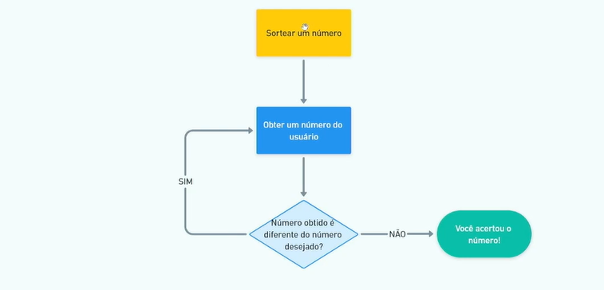
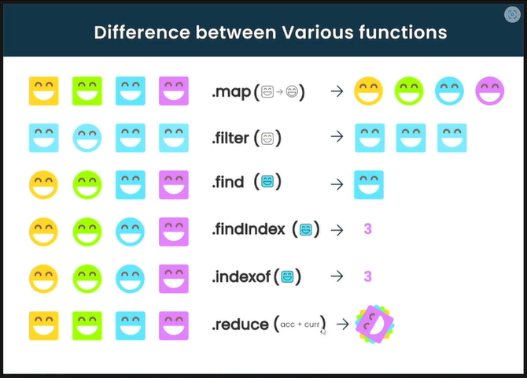

# Módulo 2 - Javascript

## 1. Javascript básico I: gerenciamento de memória dinâmica
JavaScript é tipo o maestro invisível por trás da magia na web. É uma linguagem de programação que deixa as páginas da web dançarem, fazendo coisas como animações, validação de formulários, e interações sem precisar dar um reload na página toda hora. É como o tempero secreto que dá vida aos sites, tornando-os dinâmicos e interativos. Então, quando você clica em um botão e algo legal acontece na tela sem que a página toda recarregue, agradeça ao JavaScript!


O primeiro hello world:
```
  //imprimindo mensagem no terminal
  //';' é opcional
  console.log('hello world')
  console.log("estamos na nossa aula inicial")
```

### Variáveis

Variáveis são espaços de memória onde você pode armazenar diferentes tipos de dados, como números, texto, listas, etc. No contexto de JavaScript, você pode criar uma variável usando as palavras-chave var, let ou const.

- var: Era a forma antiga de declarar variáveis em JavaScript, mas não é tão recomendada hoje em dia devido a algumas peculiaridades de escopo.
- let: É a forma moderna de declarar variáveis que podem ser alteradas posteriormente. Elas têm escopo de bloco, o que significa que só são acessíveis dentro do bloco em que foram definidas.
- const: É usada para declarar variáveis cujo valor não mudará. Elas também têm escopo de bloco.
Aqui está um exemplo de como você pode usar variáveis em JavaScript:

```
/* 
  Utilize sempre o Camel case no Javascript
  Javascript possui tipagem dinâmica: infere os tipos de dados
  Javascript possui uma tipagem fraca

*/
//comando let: cria variável (não precisa especificar tipo)
let nome = 'Bruno' //string
let idade = 27 //number
let altura = 1.75 //number
let estudando = true // boolean / booleano: verdadeiro ou falso

let nulo = null // null
let outro // undefined
let outra = undefined // undefined
var variavel = 30 // declaração de várial de escopo global 

const dataNascimento = '08/11/1996' //não muda, constante

console.log(nome)
console.log(idade)
console.log(altura)
console.log(estudando)

console.log(nome, typeof nome) // typeof: é operador unário
console.log(idade, typeof idade)
console.log(altura, typeof altura)
console.log(estudando, typeof estudando)
console.log(nulo, typeof nulo)
console.log(outro, typeof outro)
console.log(outra, typeof outra)
console.log(variavel, typeof variavel)
```

#### Hoisting 

Hoisting é um comportamento em JavaScript onde declarações de variáveis e funções são movidas para o topo do seu contexto de execução durante a fase de compilação, antes da execução real do código. Isso significa que, independentemente de onde uma variável ou função é declarada no código, ela será "elevada" para o topo do seu escopo antes da execução.

Por exemplo:

```
console.log(x); // Saída: undefined
var x = 5;
console.log(x); // Saída: 5
```

No código acima, a declaração da variável x é "elevada" para o topo, então console.log(x) não causa um erro. No entanto, o valor de x ainda é undefined até que seja atribuído o valor 5. Isso ocorre porque apenas a declaração é movida para o topo, não a inicialização.

É importante notar que o hoisting só acontece com a declaração de variáveis usando var. Com let e const, as variáveis são içadas para o topo do seu bloco de escopo, mas não são inicializadas até a linha em que são declaradas, resultando em um comportamento chamado de "temporal dead zone". Isso significa que você não pode acessar essas variáveis antes de sua declaração.

### operadores aritméticos (matemáticos)

Os operadores aritméticos em JavaScript são utilizados para realizar operações matemáticas em números. Aqui estão os operadores aritméticos básicos:

Adição +: Usado para adicionar dois valores.
Subtração -: Usado para subtrair um valor de outro.
Multiplicação *: Usado para multiplicar dois valores.
Divisão /: Usado para dividir um valor pelo outro.
Módulo %: Retorna o resto da divisão entre dois valores.
Aqui estão alguns exemplos de como esses operadores são utilizados:
```
let soma = 10 + 5; // soma é 15
let subtracao = 10 - 5; // subtracao é 5
let multiplicacao = 10 * 5; // multiplicacao é 50
let divisao = 10 / 5; // divisao é 2
let resto = 10 % 3; // resto é 1 (pois 10 dividido por 3 é 3 com resto 1)
```

Além desses operadores, JavaScript também fornece o objeto Math, que contém métodos para realizar operações matemáticas mais avançadas. Aqui estão alguns exemplos:

```
let raizQuadrada = Math.sqrt(25); // raizQuadrada é 5
let potencia = Math.pow(2, 3); // potencia é 8 (2 elevado à potência de 3)
let arredondar = Math.round(4.7); // arredondar é 5 (arredonda para o número inteiro mais próximo)
let teto = Math.ceil(4.2); // teto é 5 (arredonda para cima)
let piso = Math.floor(4.7); // piso é 4 (arredonda para baixo)
let absoluto = Math.abs(-5); // absoluto é 5 (retorna o valor absoluto)
let aleatorio = Math.random(); // aleatorio é um número decimal aleatório entre 0 e 1
```

#### prompt

Para a utilização do prompt com node será necessário a utilização da biblioteca `readline-sync`.
No seu terminal dentro da pasta rode o comando abaixo:
```
npm install readline-sync
```

Utilizando ele no js:
```
const prompt = require('readline-sync')

const idade = prompt.question("Qual eh a sua idade? \n") // será necessário utilizar o .question() após a variável

const idadeNumber = Number(idade)

// Coerção Explicita ( Conversão Manual)
console.log('A sua idade é ', idadeNumber, typeof idadeNumber)
```


O prompt é uma função em JavaScript que exibe uma caixa de diálogo ao usuário, permitindo que ele insira dados. Esses dados podem ser armazenados em uma variável para serem usados posteriormente no código.

Aqui está a sintaxe básica do prompt:

```
let resposta = prompt("Por favor, insira seu nome:");


console.log('Seu nome é: ', resposta)
```

Neste exemplo, quando o código é executado, uma caixa de diálogo aparecerá na tela com a mensagem "Por favor, insira seu nome:". O usuário poderá inserir seu nome e clicar em "OK". O valor inserido pelo usuário será armazenado na variável resposta.

Agora, vamos ver um exemplo mais completo:

```
let nome = prompt("Por favor, insira seu nome:");
if (nome !== null && nome !== "") {
    alert("Olá, " + nome + "! Bem-vindo!");
} else {
    alert("Você não inseriu um nome válido.");
}
```

Neste exemplo, o código pede ao usuário para inserir seu nome. Se o usuário inserir um nome válido (ou seja, não clicar em "Cancelar" e não deixar o campo em branco), uma mensagem de saudação será exibida usando o nome inserido. Caso contrário, uma mensagem informando que um nome válido não foi inserido será exibida.

O prompt é útil para interações simples com o usuário, como solicitar informações ou confirmações antes de prosseguir com determinadas ações no seu código JavaScript.

### Coerção de tipos


ChatGPT
A coerção de tipos em JavaScript é o processo de conversão automática de um tipo de dado para outro durante a avaliação de uma expressão. Isso pode ocorrer de forma implícita, quando o JavaScript converte automaticamente os tipos para realizar uma operação, ou de forma explícita, quando você usa funções para converter explicitamente um tipo de dado em outro.

Existem dois tipos de coerção de tipos em JavaScript:

Coerção Implícita:

Isso ocorre quando o JavaScript converte automaticamente os tipos de dados para permitir a execução de uma operação. Por exemplo, quando você usa o operador de adição + com diferentes tipos de dados, o JavaScript converte os tipos conforme necessário para realizar a operação.
Exemplo de coerção implícita:

```
let x = 5; // x é um número
let y = "10"; // y é uma string
let resultado = x + y; // JavaScript converte x para uma string e então concatena com y
console.log(resultado); // Saída: "510"

```

Coerção Explícita:

Isso ocorre quando você utiliza funções para converter explicitamente um tipo de dado em outro. Por exemplo, você pode usar Number(), String(), Boolean(), entre outras funções, para realizar conversões de tipo explicitamente.
Exemplo de coerção explícita:

```
let numeroString = "10";
let numero = Number(numeroString); // converte a string para um número
console.log(numero); // Saída: 10

```

Aqui estão alguns dos tipos de coerção de tipos em JavaScript:

Coerção de String para Número: Quando uma string que representa um número é convertida para um número.
Coerção de Número para String: Quando um número é convertido para uma string.
Coerção para Booleano: Quando um valor é convertido para um booleano (verdadeiro ou falso).
Coerção para Objeto: Quando um valor primitivo é convertido em um objeto usando o construtor Object().
Coerção para Primitivo: Quando um objeto é convertido em um valor primitivo.
É importante entender como a coerção de tipos funciona em JavaScript para evitar comportamentos inesperados em seu código e garantir que suas operações sejam realizadas corretamente.

Na aula:

```
const prompt = require('readline-sync')

const idade = prompt.question("Qual eh a sua idade? \n")

const idadeNumber = Number(idade)

// Coerção Explicita ( Conversão Manual)
console.log('A sua idade é ', idadeNumber, typeof idadeNumber)

console.log(Number('x'))
console.log(String('10'), typeof String('10'))

console.log(Boolean(2), typeof Boolean(2))
console.log(Boolean(0), typeof Boolean(0))
console.log(Boolean(-1), typeof Boolean(-1))

// Coerção Implicita ()
console.log(1 + "1") // 11 - aqui ele tenta fazer a conversão normal, o mais próximo seria realizar uma concatenação
console.log(10 + "5") // 105
console.log("10" + 5) // 105
console.log(10 - "5") // 5
console.log(10 * "5") // 50
console.log(10 / "5") // 2


// Qual será a saída desse código?
let n = 1 + '1'

n = n - 1

console.log(n) // 10

// Qual será a saída desse código?
console.log( 2 + 3 + 4 + '5') // 95

// Qual será a saída desse código?
console.log('5' + 2 + 3 + 4) // 5234

// Qual será a saída desse código?
console.log('10' - '4' - '3' - 2 + '5') //15
```

## 2. Javascript básico II: condicionais

### operadores booleanos
Em JavaScript, os operadores booleanos são utilizados para avaliar expressões e retornar um valor verdadeiro (true) ou falso (false). Esses operadores são comumente usados em estruturas de controle de fluxo, como condicionais e loops, para tomar decisões com base nas condições especificadas. Os principais operadores booleanos em JavaScript são && (AND), || (OR) e ! (NOT).

- AND (&&): Retorna verdadeiro se ambas as expressões forem verdadeiras.
```
var x = 5;
var y = 10;
var z = 15;
if (x < y && y < z) {
    console.log("x é menor que y e y é menor que z");
}
```

- OR (||): Retorna verdadeiro se pelo menos uma das expressões for verdadeira.
```
var temperature = 25;
if (temperature > 30 || temperature < 10) {
    console.log("A temperatura está extremamente alta ou baixa");
}
```

- NOT (!): Inverte o valor de uma expressão booleana.

```
var loggedIn = false;
if (!loggedIn) {
    console.log("O usuário não está logado");
}
```

Além desses operadores, também existe o operador de igualdade estrita (===), que retorna verdadeiro se os operandos forem iguais e do mesmo tipo, e o operador de diferença estrita (!==), que retorna verdadeiro se os operandos não forem iguais e/ou não forem do mesmo tipo.

Exemplos da aula:

```
// Operadores booleanos: Comparações

const numero1 = 10
const numero2 = 12

console.log(numero1 == numero2) // false
console.log(numero1 === numero2) // false
console.log(numero1 === '10') // false - valida também o tipo do dado
console.log(numero1 == '10') // false - valida o valor

console.log(numero1 !== numero2) // true
console.log(numero1 != '10') // false

console.log(numero1 >= numero2)

const idadePessoa1 = 16
const idadePessoa2 = 39

console.log(idadePessoa1 >= 18 && idadePessoa2 >= 18)
console.log(idadePessoa1 >= 18 || idadePessoa2 >= 18)

console.log(!true) // not/negação

console.log(!(idadePessoa1 >= 18)) // retorna verdadeiro se a pessoa for meno de idade
```


### Estruturas de controle de fluxos e condicionais
Em JavaScript, as estruturas de controle de fluxo são usadas para determinar o fluxo de execução do programa com base em condições ou iterações. As estruturas de controle de fluxo mais comuns são os condicionais (como if, else if, else) e os loops (como for, while, do-while). Aqui estão exemplos de como usar essas estruturas:
- Condicional if:
```
var idade = 18;
if (idade >= 18) {
    console.log("Você é maior de idade.");
} else {
    console.log("Você é menor de idade.");
}

```

- Condicional else if:
```
var hora = 14;
if (hora < 12) {
    console.log("Bom dia!");
} else if (hora < 18) {
    console.log("Boa tarde!");
} else {
    console.log("Boa noite!");
}

```
- Loop for:


```
for (var i = 0; i < 5; i++) {
    console.log("O valor de i é " + i);
}

```
- Loop while:

```
var contador = 0;
while (contador < 3) {
    console.log("Contador: " + contador);
    contador++;
}

```

Essas estruturas de controle de fluxo permitem que você controle o comportamento do seu programa com base em condições e iterações, tornando seu código mais dinâmico e adaptável. 

Exemplos da aula

```
const prompt = require('readline-sync')

const idade = Number(prompt.question('Qual eh a sua idade? \n'))

const ehMaiorDeIdade = idade >= 18

console.log(ehMaiorDeIdade)

// Estrutura condicional: if/else

if(ehMaiorDeIdade){
  // faça alguma coisa
  console.log('Você é maior de idade!')
} else {
  console.log("Você é menor de idade.")
}

const mediaDoAluno = 10

// Média >=7 => aprovado
// Média < 7 e Média >=5 => Prova final 
// Média < 5 => Reprovvado

if(mediaDoAluno >= 7){
  console.log("Aprovado!")
  console.log("Parabéns! 😁👏")
} else if ( mediaDoAluno >= 5){
  console.log("Prova final!")
} else {
  console.log("Reprovado")
}


// 1. Preciso ser maior de idade
// 2. Preciso ter uma CNH

const idadeDaPessoa = 18
const temCNH = true

if (idadeDaPessoa >= 18 && temCNH){
  console.log("Você pode dirigir!")
} else {
  console.log("Você não pode dirigir!")
}
```

Além das estruturas de controle de fluxo mencionadas anteriormente (condicionais e loops), JavaScript também oferece outras estruturas úteis para controlar o fluxo de execução do programa:

- Switch Case:
O switch é usado para avaliar uma expressão e executar o bloco de código associado ao caso que corresponde ao valor da expressão.

```
var dia = 3;
switch (dia) {
    case 1:
        console.log("Domingo");
        break;
    case 2:
        console.log("Segunda-feira");
        break;
    case 3:
        console.log("Terça-feira");
        break;
    // Outros casos...
    default:
        console.log("Dia inválido");
}

```

 - Break e Continue:
O break é usado para sair de uma estrutura de controle (como switch ou loop) e o continue é usado para pular para a próxima iteração de um loop.

```
for (var i = 0; i < 5; i++) {
    if (i === 3) {
        break; // Sai do loop quando i for igual a 3
    }
    console.log("i: " + i);
}

for (var i = 0; i < 5; i++) {
    if (i === 2) {
        continue; // Pula para a próxima iteração quando i for igual a 2
    }
    console.log("i: " + i);
}

```

- Try Catch Finally:
As estruturas try, catch e finally são usadas para manipulação de exceções (erros) em JavaScript.

```
try {
    // Bloco de código que pode gerar um erro
    var resultado = soma(10, "abc"); // Erro: "abc" não é um número
} catch (erro) {
    // Bloco de código para tratar o erro
    console.log("Ocorreu um erro: " + erro.message);
} finally {
    // Bloco de código opcional que é sempre executado, independentemente de ocorrer um erro ou não
    console.log("Finalizando...");
}

```

Essas são algumas das outras estruturas de controle de fluxo em JavaScript que permitem controlar o fluxo de execução do seu código de maneira mais eficiente e robusta.

E essas são consideradas estruturas modernas

- For...in:
O loop for...in é usado para iterar sobre as propriedades de um objeto.

```
var pessoa = { nome: "João", idade: 30, cidade: "São Paulo" };
for (var propriedade in pessoa) {
    console.log(propriedade + ": " + pessoa[propriedade]);
}

```

- For...of:
O loop for...of é usado para iterar sobre objetos iteráveis (como arrays e strings).
```
var numeros = [1, 2, 3, 4, 5];
for (var numero of numeros) {
    console.log(numero);
}

```

JavaScript introduziu estruturas de repetição modernas com for...of, for await...of para iterar sobre iteráveis assíncronos, e Array.prototype.forEach() para iterar sobre arrays.
```
// Exemplo com for...of
const frutas = ["Maçã", "Banana", "Morango"];
for (const fruta of frutas) {
    console.log(fruta);
}

// Exemplo com forEach()
frutas.forEach(function(fruta) {
    console.log(fruta);
});

```

- Operador Ternário:
O operador ternário (? :) é uma forma concisa de expressar uma operação condicional.
```
var idade = 20;
var status = (idade >= 18) ? "Maior de idade" : "Menor de idade";
console.log(status);

```

- Labelled Statements:
Você pode rotular loops e blocos para referenciá-los de forma explícita.
```
outerloop:
for (var i = 0; i < 3; i++) {
    for (var j = 0; j < 3; j++) {
        if (i === 1 && j === 1) {
            break outerloop;
        }
        console.log('i = ' + i + ', j = ' + j);
    }
}

```

 - Async/Await:
Essas palavras-chave são usadas para lidar com operações assíncronas de forma síncrona, simplificando o código e tornando-o mais legível.

```
async function obterDados() {
    try {
        let resposta = await fetch('https://api.exemplo.com/dados');
        let dados = await resposta.json();
        console.log(dados);
    } catch (erro) {
        console.log('Ocorreu um erro: ', erro);
    }
}

```

### Thruty e Falsy

Em JavaScript, valores "truthy" e "falsy" referem-se à maneira como certos valores são avaliados em contextos booleanos, como em instruções condicionais (if), operadores lógicos (&&, ||), entre outros. Valores "truthy" são aqueles que são considerados como verdadeiros quando avaliados como booleanos, enquanto valores "falsy" são aqueles que são considerados como falsos.

Aqui está uma lista dos principais valores "falsy" em JavaScript:

false
0 (zero)
"" (string vazia)
null
undefined
NaN (Not a Number)
Todos os outros valores que não estão nesta lista são considerados "truthy", incluindo, por exemplo, strings não vazias, números diferentes de zero, objetos, arrays, funções, etc.

```
var x = 10;

if (x) {
    console.log("x é truthy"); // Esta condição será verdadeira, pois x contém um valor diferente de zero
}

var y = "";

if (!y) {
    console.log("y é falsy"); // Esta condição será verdadeira, pois y é uma string vazia, que é falsy
}

var z = null;

if (z === null) {
    console.log("z é falsy"); // Esta condição será verdadeira, pois z é null, que é falsy
}

var objeto = {};

if (objeto) {
    console.log("objeto é truthy"); // Esta condição será verdadeira, pois objeto é um objeto vazio, que é truthy
}

```

Entender os conceitos de "truthy" e "falsy" é importante ao lidar com expressões booleanas em JavaScript, pois permite escrever código mais conciso e expressivo.

## 3. Javascript básico III: laços condicionais

### O que são estruturas de repetição?
As estruturas de repetição em JavaScript (e em muitas outras linguagens de programação) são utilizadas para executar um bloco de código várias vezes de forma automática, com base em uma condição específica. Isso evita a necessidade de repetir o mesmo código manualmente várias vezes, tornando o processo mais eficiente e menos propenso a erros.

Em JavaScript, as principais estruturas de repetição são:

1. for: Executa um bloco de código um número específico de vezes.
```
for (inicialização; condição; incremento) {
    // código a ser repetido
}
```
2. while: Executa um bloco de código enquanto uma condição específica for verdadeira.

```
while (condição) {
    // código a ser repetido
}

```

3. do...while: Similar ao while, mas garante que o bloco de código seja executado pelo menos uma vez, antes de verificar a condição.
```
do {
    // código a ser repetido
} while (condição);

```
4. for...in: Itera sobre as propriedades enumeráveis de um objeto.

```
for (variável in objeto) {
    // código a ser repetido
}
```
5. for...of: Itera sobre objetos iteráveis (como Arrays, Strings, Maps, Sets, etc.).

```
for (variável of iterável) {
    // código a ser repetido
}
```

Cada uma dessas estruturas de repetição tem sua aplicação específica, dependendo do problema que você está tentando resolver. Elas permitem automatizar tarefas repetitivas e são fundamentais para muitos algoritmos e programas JavaScript.

### Laços condicionais
Em programação, "laços condicionais" não é um termo comum ou específico. Pode haver uma confusão com dois conceitos distintos: estruturas de repetição e estruturas condicionais.

1. Estruturas de Repetição: São construções que permitem executar um bloco de código repetidamente enquanto uma condição específica for verdadeira. Isso inclui for, while, do...while, for...in, e for...of, conforme mencionado anteriormente.

2. Estruturas Condicionais: São construções que permitem executar diferentes blocos de código com base em condições específicas. As estruturas condicionais mais comuns em JavaScript são:
    - if...else: Executa um bloco de código se uma condição for verdadeira e outro bloco se a condição for falsa.
    ```
    if (condição) {
    // código se condição for verdadeira
    } else {
        // código se condição for falsa
    }

    ```
    - switch: Permite avaliar uma expressão e executar um bloco de código correspondente a um dos casos, podendo ter um caso padrão para situações não previstas.
    ```
    switch (expressão) {
        case valor1:
            // código se expressão igual a valor1
            break;
        case valor2:
            // código se expressão igual a valor2
            break;
        default:
            // código se expressão não corresponder a nenhum caso
    }

    ```
    " Laços condicionais" não é um termo comummente utilizado na programação para descrever um conceito específico, as estruturas de repetição e as estruturas condicionais são fundamentais para controlar a execução de código de maneira eficiente e lógica. Estas estruturas condicionais permitem controlar o fluxo do programa com base em condições lógicas, permitindo que diferentes caminhos de execução sejam seguidos dependendo das circunstâncias.

    #### Teste de númearo aleatório
  

## 4. Javascript básico IV: Laços numéricos

Em JavaScript, os conceitos de laços numéricos e laços condicionais são bastante semelhantes aos exemplos que mencionei anteriormente, mas com a sintaxe específica da linguagem. Vamos explorar como você pode implementar e diferenciar esses dois tipos de laços em JavaScript:

Laços Numéricos em JavaScript
Exemplo usando for:
```
// Exemplo de um laço numérico que imprime os números de 1 a 5
for (let i = 1; i <= 5; i++) {
    console.log(i);
}
```

Neste exemplo:

- for (let i = 1; i <= 5; i++) define um laço for que começa com i igual a 1, continua enquanto i for menor ou igual a 5, e incrementa i em cada iteração.
- console.log(i) imprime o valor atual de i.
**Laços Condicionais em JavaScript**
Exemplo usando while:
```
// Exemplo de um laço condicional que imprime números até que um limite seja atingido
let numero = 1;
while (numero <= 5) {
    console.log(numero);
    numero++;
}
```

Neste exemplo:

- while (numero <= 5) verifica se numero é menor ou igual a 5 antes de cada iteração.
- console.log(numero) imprime o valor atual de numero.
- numero++ incrementa numero a cada iteração.
### Diferenças entre Laços Numéricos e Laços Condicionais em JavaScript
1. Critério de Execução:
    - Laços Numéricos: Executam um número fixo de vezes com base em uma contagem predefinida.
    - Laços Condicionais: Executam enquanto uma condição específica for verdadeira.
2. Sintaxe de Controle:
    - Laços Numéricos: Utilizam for com uma inicialização, uma condição de continuação e um incremento.
    - Laços Condicionais: Utilizam while com uma condição booleana que é verificada antes de cada iteração.
3. Uso de Variáveis de Controle:
    - Laços Numéricos: Normalmente usam uma variável de controle (como i no exemplo do for).
    - Laços Condicionais: Dependem de uma condição booleana que pode mudar ao longo da execução.
4. Aplicabilidade:
    - Laços Numéricos: Úteis quando se sabe exatamente quantas iterações são necessárias.
    - Laços Condicionais: Úteis quando a quantidade de iterações pode variar dependendo de uma condição.

### Arrays
Arrays em JavaScript são estruturas de dados que permitem armazenar vários elementos em uma única variável. Eles são usados para armazenar coleções de dados de forma ordenada, onde cada elemento é acessado por um índice numérico (começando em 0).

Principais características dos arrays em JavaScript:

Coleção Ordenada: Os elementos em um array são organizados em uma sequência ordenada. Cada elemento tem um índice que determina sua posição no array.

Tipagem Dinâmica: Arrays em JavaScript podem conter elementos de diferentes tipos de dados (números, strings, objetos, outros arrays, etc.).

Acesso por Índice: Cada elemento em um array é acessado através de um índice numérico. O primeiro elemento tem índice 0, o segundo índice 1, e assim por diante.

Tamanho Variável: Em JavaScript, os arrays são dinâmicos, o que significa que seu tamanho pode ser alterado adicionando ou removendo elementos. Não é necessário especificar um tamanho fixo ao criar um array.

Exemplo básico de uso de arrays em JavaScript:
```
// Criando um array com números inteiros
let numbers = [1, 2, 3, 4, 5];

// Acessando elementos do array por índice
console.log(numbers[0]); // Saída: 1
console.log(numbers[2]); // Saída: 3

// Alterando um elemento do array
numbers[1] = 10;
console.log(numbers); // Saída: [1, 10, 3, 4, 5]

// Adicionando um elemento ao final do array
numbers.push(6);
console.log(numbers); // Saída: [1, 10, 3, 4, 5, 6]

// Removendo o último elemento do array
numbers.pop();
console.log(numbers); // Saída: [1, 10, 3, 4, 5]
```
Arrays são uma estrutura de dados fundamental em JavaScript e são amplamente utilizados para armazenar e manipular coleções de dados de forma eficiente.

Os arrays em JavaScript possuem uma variedade de métodos integrados que permitem manipular e acessar seus elementos de maneira eficiente. Aqui estão alguns dos métodos principais mais utilizados:

1. Métodos para adicionar e remover elementos

- **`push(element1, ..., elementN)`**: Adiciona um ou mais elementos ao final do array e retorna o novo comprimento do array.
- **`pop()`**: Remove o último elemento do array e retorna esse elemento.
- **`unshift(element1, ..., elementN)`**: Adiciona um ou mais elementos no início do array e retorna o novo comprimento do array.
- **`shift()`**: Remove o primeiro elemento do array e retorna esse elemento.

2. Métodos para acessar e percorrer o array

- **`concat(array2, array3, ..., arrayN)`**: Retorna um novo array resultante da concatenação do array atual com outros arrays ou valores passados como argumento.
- **`join(separator)`**: Cria e retorna uma string concatenando todos os elementos do array, separados por um separador especificado (por padrão, uma vírgula `','`).
- **`slice(start, end)`**: Retorna uma cópia superficial do array, começando do índice `start` até o índice `end` (não incluído). O array original não é modificado.
- **`forEach(callback(currentValue, index, array), thisArg)`**: Executa uma função callback uma vez para cada elemento no array, em ordem, e opcionalmente permite definir o contexto (`thisArg`) dentro do qual a função é executada.

3. Métodos para modificar o array

- **`splice(start, deleteCount, item1, item2, ...)`**: Modifica o conteúdo de um array, removendo elementos existentes e/ou adicionando novos elementos.
- **`reverse()`**: Inverte a ordem dos elementos do array.
- **`sort(compareFunction)`**: Ordena os elementos do array in-place e retorna o array ordenado. Se não for fornecida uma função de comparação (`compareFunction`), os elementos são convertidos para strings e ordenados como strings Unicode.

4. Métodos para verificar e encontrar elementos

- **`indexOf(searchElement, fromIndex)`**: Retorna o primeiro índice em que um elemento especificado pode ser encontrado no array, ou -1 se o elemento não estiver presente.
- **`lastIndexOf(searchElement, fromIndex)`**: Retorna o último índice em que um elemento especificado pode ser encontrado no array, ou -1 se o elemento não estiver presente.
- **`includes(searchElement, fromIndex)`**: Determina se o array contém um determinado elemento, retornando true ou false conforme a correspondência.

5. Métodos para filtrar e transformar elementos

- **`filter(callback(currentValue, index, array), thisArg)`**: Cria um novo array com todos os elementos que passaram por um teste especificado na função callback.
- **`map(callback(currentValue, index, array), thisArg)`**: Cria um novo array com os resultados da chamada de uma função callback para cada elemento do array.

## 5. Javascript básico V: Funções
Funções em JavaScript são blocos de código projetados para realizar uma tarefa específica. Elas são fundamentais para modularizar o código, promover reutilização e tornar o código mais organizado e legível.

#### Definindo uma Função

Uma função em JavaScript é definida usando a palavra-chave `function`, seguida pelo nome da função, parênteses `()` que podem conter parâmetros (valores que a função espera receber) e um bloco de código entre chaves `{}` que contém as instruções a serem executadas pela função.

Exemplo de função que calcula a soma de dois números:

```
function soma(a, b) {
    return a + b;
}
```

#### Chamando uma Função
Depois de definida, uma função pode ser chamada (ou invocada) em qualquer parte do código, especificando seu nome seguido pelos parênteses () contendo os argumentos (valores concretos que são passados para os parâmetros da função durante sua execução).

Exemplo de chamada da função soma definida acima:
```
let resultado = soma(5, 3); // Chamando a função soma com argumentos 5 e 3
console.log(resultado); // Saída: 8
```
#### Características Importantes das Funções em JavaScript
- Escopo: Funções em JavaScript têm escopo próprio. Variáveis declaradas dentro de uma função são locais a essa função (a menos que sejam declaradas como globais ou capturadas por funções de fechamento - closures).

- Retorno: Uma função pode retornar um valor utilizando a palavra-chave return. O retorno pode ser qualquer tipo de dado, incluindo números, strings, objetos e até outras funções.

- Funções Anônimas: Funções que não têm um nome específico são chamadas de funções anônimas. Elas são frequentemente utilizadas como argumentos para outras funções ou atribuídas a variáveis.

Exemplo de função anônima:
```
let quadrado = function(x) {
    return x * x;
};

console.log(quadrado(5)); // Saída: 25
```

- Funções de Flecha (Arrow Functions): Introduzidas no ECMAScript 6 (ES6), as arrow functions são uma sintaxe mais curta e simplificada para definir funções em JavaScript.
Exemplo de arrow function:

```
let dobrar = (x) => x * 2;
console.log(dobrar(4)); // Saída: 8
```

As funções em JavaScript são flexíveis e poderosas, sendo uma parte essencial da linguagem para criar abstrações, modularizar o código e melhorar a manutenibilidade de programas complexos.

### Resumindo
Basicamente é um bloco de código que você consegue reaproveitar.

Aplicando o tal do DRY

DRY é um acrônimo que significa "Don't Repeat Yourself", em português "Não Repita a Si Mesmo". Esse princípio é uma filosofia de desenvolvimento de software que promove a redução da repetição de código ao máximo possível. Em outras palavras, o DRY incentiva os programadores a escreverem código de maneira que cada parte do conhecimento (lógica ou informação) esteja representada exatamente uma vez em todo o sistema.

Princípios do DRY:
Eliminação de Duplicação: Evitar repetir trechos de código sem necessidade, concentrando a lógica em um único lugar. Isso não só reduz o tamanho do código, mas também simplifica a manutenção e melhora a consistência do sistema.

Reutilização de Código: Ao aplicar o DRY, partes do código que realizam tarefas similares podem ser encapsuladas em funções, classes ou componentes que podem ser facilmente reutilizados em diferentes partes do programa.

Manutenção Simplificada: Ao centralizar a lógica em um único lugar, qualquer alteração necessária pode ser feita em um único ponto, reduzindo o risco de introduzir erros devido a inconsistências causadas pela duplicação de código.

Exemplo de Aplicação do DRY:
Imagine que você tem um programa que precisa calcular a área de diferentes formas geométricas (círculo, quadrado, triângulo). Em vez de repetir o cálculo da área em cada parte do código onde você precisa, você pode criar uma função que calcula a área com base nos parâmetros recebidos.

Exemplo em JavaScript: 
```
// Exemplo sem DRY (repetindo código)
function calcularAreaCirculo(raio) {
    return Math.PI * raio * raio;
}

function calcularAreaQuadrado(lado) {
    return lado * lado;
}

function calcularAreaTriangulo(base, altura) {
    return (base * altura) / 2;
}

// Exemplo com DRY (reutilizando código)
function calcularAreaFormaGeometrica(tipo, parametros) {
    switch (tipo) {
        case 'circulo':
            return Math.PI * parametros.raio * parametros.raio;
        case 'quadrado':
            return parametros.lado * parametros.lado;
        case 'triangulo':
            return (parametros.base * parametros.altura) / 2;
        default:
            throw new Error('Tipo de forma geométrica inválido');
    }
}

// Uso da função genérica calcularAreaFormaGeometrica
let areaCirculo = calcularAreaFormaGeometrica('circulo', { raio: 5 });
let areaQuadrado = calcularAreaFormaGeometrica('quadrado', { lado: 4 });
let areaTriangulo = calcularAreaFormaGeometrica('triangulo', { base: 3, altura: 6 });

console.log(areaCirculo);   // Saída: ~78.54
console.log(areaQuadrado);  // Saída: 16
console.log(areaTriangulo); // Saída: 9
```
A função ```calcularAreaFormaGeometrica``` centraliza a lógica de cálculo da área, eliminando a duplicação de código e facilitando a adição de novos tipos de formas geométricas sem repetir a lógica de cálculo.

Em resumo, aplicar o princípio DRY não apenas melhora a eficiência do desenvolvimento de software, mas também contribui significativamente para a manutenção, escalabilidade e legibilidade do código.

### First-Class Functions em JavaScript

Em linguagens de programação, o termo "first-class functions" refere-se à capacidade de tratar funções como valores de primeira classe. Em JavaScript, as funções são tratadas como first-class citizens, o que significa que elas podem ser:

- Armazenadas em variáveis ou constantes
- Passadas como argumentos para outras funções
- Retornadas por outras funções

#### Exemplos

 1. Atribuir Funções a Variáveis

``` 
// Atribuir uma função a uma variável
const soma = function(a, b) {
    return a + b;
};
console.log(soma(2, 3)); // Saída: 5
```
2. Passar Funções como Argumentos
```
// Função que recebe outra função como argumento
function operacaoMatematica(a, b, operacao) {
    return operacao(a, b);
}

function multiplicacao(x, y) {
    return x * y;
}

console.log(operacaoMatematica(3, 4, multiplicacao)); // Saída: 12
```
3. Retornar Funções de Outras Funções
```
// Função que retorna outra função
function criarSomador(x) {
    return function(y) {
        return x + y;
    };
}

let somarCom5 = criarSomador(5);
console.log(somarCom5(3)); // Saída: 8

```
**Benefícios das First-Class Functions**
- Flexibilidade: Permite criar abstrações poderosas e expressivas.
- Composição: Facilita a composição de funções e o desenvolvimento orientado a funções.
- Passagem de Comportamento: Facilita a implementação de padrões de projeto como callbacks, promessas e programação funcional.

O suporte a first-class functions em JavaScript é fundamental para a programação funcional e para a criação de código modular, reutilizável e fácil de entender. Ao entender e utilizar esse conceito, os desenvolvedores podem aproveitar ao máximo a flexibilidade e a capacidade de expressão da linguagem.

### Object 
Em JavaScript, um objeto (object) é uma estrutura de dados fundamental que permite armazenar dados e funcionalidades relacionadas como pares de chave-valor. É uma das principais maneiras de representar e organizar informações dentro da linguagem.

**Definição e Estrutura de um Objeto**
Um objeto em JavaScript é definido como uma coleção de pares chave-valor, onde:

- A chave (também chamada de propriedade) é uma string que identifica exclusivamente a propriedade do objeto.
- O valor pode ser qualquer tipo de dado JavaScript: primitivo (como números, strings, booleanos), objetos, funções, e até mesmo outros objetos.
Exemplo Básico de Objeto em JavaScript

```
// Exemplo de um objeto representando um carro
let carro = {
    marca: 'Toyota',
    modelo: 'Corolla',
    ano: 2020,
    cor: 'prata',
    ligar: function() {
        console.log('O carro está ligado.');
    }
};

// Acessando propriedades do objeto
console.log(carro.marca); // Saída: Toyota
console.log(carro.ano);   // Saída: 2020

// Chamando um método do objeto
carro.ligar(); // Saída: O carro está ligado.
```

**Utilizando Objetos em JavaScript**
1. Criando Objetos:
    - Você pode criar um objeto diretamente utilizando a sintaxe de chaves {} e definindo suas propriedades e métodos dentro das chaves.

2. Acessando Propriedades:
    - As propriedades de um objeto são acessadas utilizando a notação de ponto (objeto.propriedade) ou a notação de colchetes (objeto['propriedade']).
3. Adicionando ou Modificando Propriedades:
    - Você pode adicionar novas propriedades a um objeto a qualquer momento ou modificar propriedades existentes.
```
    let pessoa = {
        nome: 'Ana',
        idade: 30,
        profissao: 'engenheira'
    };

    // Adicionar uma nova propriedade
    pessoa.cidade = 'São Paulo';

    // Modificar uma propriedade existente
    pessoa.profissao = 'desenvolvedora';

    console.log(pessoa); // Saída: { nome: 'Ana', idade: 30, profissao: 'desenvolvedora', cidade: 'São Paulo' }
```
4. Métodos em Objetos:
    - Funções dentro de objetos são chamadas de métodos. Elas permitem que você associe comportamentos específicos ao objeto.
```
    let aluno = {
        nome: 'João',
        idade: 25,
        mostrarDados: function() {
            console.log(`Nome: ${this.nome}, Idade: ${this.idade}`);
        }
    };

    aluno.mostrarDados(); // Saída: Nome: João, Idade: 25
```

5. Iteração sobre Propriedades:
    - Você pode iterar sobre as propriedades de um objeto usando loops for...in ou métodos como Object.keys(), Object.values() e Object.entries().
```
    let livro = {
        titulo: 'JavaScript: The Good Parts',
        autor: 'Douglas Crockford',
        anoPublicacao: 2008
    };

    for (let chave in livro) {
        console.log(`${chave}: ${livro[chave]}`);
    }
    // Saída:
    // titulo: JavaScript: The Good Parts
    // autor: Douglas Crockford
    // anoPublicacao: 2008

```
Objetos em JavaScript são fundamentais para representar dados estruturados e funcionalidades relacionadas em uma forma organizada e acessível. Eles permitem modelar entidades do mundo real e são amplamente utilizados em programação para criar estruturas de dados complexas e interativas. Dominar o uso de objetos é essencial para desenvolver aplicativos robustos e eficientes em JavaScript.

### Desestruturação (Destructuring) em JavaScript

A desestruturação é uma característica poderosa introduzida no ECMAScript 6 (também conhecido como ES6 ou ES2015) que permite extrair dados de arrays ou objetos em variáveis distintas de forma concisa e intuitiva. Ela facilita o trabalho com estruturas de dados complexas, como arrays e objetos, tornando o código mais limpo e legível.

#### Desestruturação de Arrays

Exemplo Básico

```
// Exemplo de desestruturação de um array
let numeros = [1, 2, 3, 4, 5];

// Desestruturando o array em variáveis individuais
let [primeiro, segundo, terceiro] = numeros;

console.log(primeiro);  // Saída: 1
console.log(segundo);   // Saída: 2
console.log(terceiro);  // Saída: 3
```
**Ignorando Elementos**
```
// Ignorando elementos em um array
let [primeiro, , terceiro] = numeros;

console.log(primeiro);  // Saída: 1
console.log(terceiro);  // Saída: 3
```

**Desestruturação com Valores Padrão**
```
// Desestruturação com valores padrão
let [primeiro, segundo, terceiro, quarto = 0] = numeros;

console.log(quarto);  // Saída: 4 (valor padrão)
```

**Troca de Variáveis**

```
// Trocando variáveis usando desestruturação
let a = 1;
let b = 2;

[a, b] = [b, a];

console.log(a); // Saída: 2
console.log(b); // Saída: 1
```
#### Desestruturação de Objetos

**Exemplo básico**
```
    // Exemplo de desestruturação de um objeto
    let pessoa = { nome: 'Maria', idade: 30 };

    // Desestruturando o objeto em variáveis individuais
    let { nome, idade } = pessoa;

    console.log(nome);  // Saída: Maria
    console.log(idade); // Saída: 30
```

**Renomeando Variáveis**
```
// Renomeando variáveis ao desestruturar um objeto
let { nome: primeiroNome, idade: anos } = pessoa;

console.log(primeiroNome);  // Saída: Maria
console.log(anos);          // Saída: 30
```

**Desestruturação com Valores Padrão**
```
// Desestruturação de objeto com valores padrão
let { cidade = 'São Paulo', estado } = pessoa;

console.log(cidade); // Saída: São Paulo (valor padrão)
console.log(estado); // Saída: undefined (propriedade não definida no objeto)
```

#### Utilizações Avançadas

**Desestruturação em Parâmetros de Funções**
```
// Utilizando desestruturação em parâmetros de função
function mostrarInfo({ nome, idade }) {
    console.log(`Nome: ${nome}, Idade: ${idade}`);
}

mostrarInfo(pessoa); // Saída: Nome: Maria, Idade: 30

```

**Desestruturação Aninhada**
```
// Desestruturação aninhada de objetos
let usuario = {
    nome: 'João',
    endereco: {
        cidade: 'Rio de Janeiro',
        pais: 'Brasil'
    }
};

let { nome, endereco: { cidade, pais } } = usuario;

console.log(nome);   // Saída: João
console.log(cidade); // Saída: Rio de Janeiro
console.log(pais);   // Saída: Brasil

```

**Benefícios da Desestruturação**
- Redução de Código: Simplifica a extração de dados de estruturas complexas em uma única linha.
- Legibilidade: Torna o código mais claro e fácil de entender, especialmente ao lidar com muitos dados.
- Flexibilidade: Permite renomear variáveis, definir valores padrão e realizar operações avançadas de forma eficiente.
- A desestruturação é uma funcionalidade poderosa e versátil em JavaScript, sendo amplamente adotada em programação moderna para melhorar a eficiência e a organização do código.

## 6 - 7. Javascript Intermediário I e II: Funcional

### Funções de alta ordem
Funções de alta ordem (higher-order functions) são funções que podem receber outras funções como argumentos e/ou retornar outras funções como resultado. Em linguagens de programação funcional, como JavaScript, isso é uma característica poderosa que permite tratar funções não apenas como blocos de código isolados, mas como valores que podem ser manipulados e combinados de diversas maneiras.

#### Características das Funções de Alta Ordem:
1. Aceitar Funções como Argumentos:
    - Funções de alta ordem podem receber outras funções como parâmetros. Isso permite passar comportamentos específicos para serem executados dentro da função de alta ordem.

2. Retornar Funções como Resultado:
    - Além de receber funções como argumentos, funções de alta ordem também podem retornar funções como seu resultado. Isso é útil para criar funções mais especializadas ou para implementar padrões de design como funções de fábrica.

3. Armazenar Funções em Variáveis ou Estruturas de Dados:
    - Funções de alta ordem podem armazenar funções em variáveis ou estruturas de dados, tratando-as como qualquer outro tipo de dado. Isso é parte do paradigma funcional que promove imutabilidade e composição de funções.

#### Exemplos de Funções de Alta Ordem em JavaScript:
**Exemplo 1: Função que recebe uma função como parâmetro**
```
function executarOperacao(a, b, operacao) {
    return operacao(a, b);
}

function soma(x, y) {
    return x + y;
}

function multiplicacao(x, y) {
    return x * y;
}

console.log(executarOperacao(5, 3, soma)); // Saída: 8
console.log(executarOperacao(5, 3, multiplicacao)); // Saída: 15
```

Neste exemplo, ```executarOperacao``` é uma função de alta ordem que recebe soma e multiplicacao como argumentos. Dependendo da função passada como terceiro parâmetro, ela realiza a operação desejada.

**Exemplo 2: Função que retorna uma função**

```
function criarMultiplicador(n) {
    return function(x) {
        return x * n;
    };
}

let duplicar = criarMultiplicador(2);
let triplicar = criarMultiplicador(3);

console.log(duplicar(5)); // Saída: 10
console.log(triplicar(5)); // Saída: 15

```

Neste exemplo, ```criarMultiplicador``` é uma função de alta ordem que retorna uma função baseada no parâmetro ```n```. As funções ```duplicar``` e triplicar são criadas com base em ```criarMultiplicador``` e podem ser usadas para multiplicar números por 2 e 3, respectivamente.

#### Benefícios das Funções de Alta Ordem:
- Abstração de Comportamento: Permitem encapsular comportamentos específicos que podem ser reutilizados com diferentes entradas.
- Composição de Funções: Facilitam a construção de código mais modular e legível, com funções pequenas e específicas.
- Flexibilidade e Reutilização: Permitem adaptar e reutilizar comportamentos em diferentes contextos, promovendo um código mais flexível e menos repetitivo.

Em resumo, funções de alta ordem são uma parte essencial da programação funcional e proporcionam uma maneira poderosa de trabalhar com funções como cidadãs de primeira classe em JavaScript e outras linguagens de programação que suportam esse paradigma.

### Funções de alta ordem de arrays

- ```foreach()```
    A função forEach() permite executar uma função callback uma vez para cada elemento em um array. É útil quando você quer realizar uma operação em cada elemento do array sem modificar o array original. Vamos explorar como funciona e alguns exemplos de uso:
```
// 1. Array Array.prototype.foreach()
const numeros = [40,34,67,89,23,10]

function imprimirElemento(e){
  console.log(e)
}

numeros.forEach(imprimirElemento)

numeros.forEach((elemento, index, arrayCompleto)=>{
  console.log(elemento, index, arrayCompleto)
})
/*
    40 0 [ 40, 34, 67, 89, 23, 10 ]
    34 1 [ 40, 34, 67, 89, 23, 10 ]
    67 2 [ 40, 34, 67, 89, 23, 10 ]
    89 3 [ 40, 34, 67, 89, 23, 10 ]
    23 4 [ 40, 34, 67, 89, 23, 10 ]
    10 5 [ 40, 34, 67, 89, 23, 10 ]
*/

```


- ```find()```
A função find() permite encontrar o primeiro elemento em um array que satisfaz uma condição específica. Ela retorna o valor do primeiro elemento encontrado que passa no teste fornecido por uma função callback. Caso nenhum elemento satisfaça a condição, find() retorna undefined.
```
// 2. Array Array.prototype.find()
const numeros = [40,34,67,89,23,10]

const encontrado = numeros.find((numero) => {
  return numero > 50
})
console.log(encontrado)

  // array de objetos
const pessoas = [
  {
    nome: "Pessoa 1",
    idade: 34,
  },
  {
    nome: "Pessoa 2",
    idade: 25,
  },
  {
    nome: "Pessoa 3",
    idade: 46,
  }
]

const encontrarPessoa = pessoas.find((pessoa) => pessoa.idade > 40 )
console.clear()
console.log(encontrarPessoa)

```

- ```findIndex()```
A função findIndex() é mais uma das poderosas funções disponíveis para manipulação de arrays em JavaScript. Ela é semelhante à função find(), porém em vez de retornar o elemento encontrado, findIndex() retorna o índice do primeiro elemento no array que satisfaz a condição de teste fornecida por uma função callback. Caso nenhum elemento satisfaça a condição, findIndex() retorna -1.
```
// 3. Array.prototype.findIndex(): muito parecido com o find(), porém ele retorna o índice do elemento encontrado

const pessoas = [
  {
    nome: "Pessoa 1",
    idade: 34,
    altura: 1.75
  },
  {
    nome: "Pessoa 2",
    idade: 25,
    altura: 1.56
  },
  {
    nome: "Pessoa 3",
    idade: 46,
    altura: 1.82
  }
]

const encontrarIndicePessoa = pessoas.findIndex((pessoa) => pessoa.idade > 20 && pessoa.altura < 1.7 )
console.clear()
console.log(encontrarIndicePessoa)
```

- ```every()```
A função every() verifica se todos os elementos de um array satisfazem uma condição específica. Ela retorna true se todos os elementos passarem no teste definido pela função callback, caso contrário, retorna false.
```
let numeros = [40,34,67,89,23,10]
const todosPositivos = numeros.every((elemento) => elemento >= 0 /*30 - false */)

console.log(todosPositivos) // true - ele só retona boolean

const pessoas = [
  {
    nome: "Pessoa 1",
    idade: 34,
    altura: 1.75
  },
  {
    nome: "Pessoa 2",
    idade: 25,
    altura: 1.56
  },
  {
    nome: "Pessoa 3",
    idade: 46,
    altura: 1.82
  }
]

const todosMaioresDeIdade = pessoas.every((elemento) => elemento.idade >= 18 ** elemento.altura >= 1.78)

console.log(todosMaioresDeIdade)
```

- ```some()```
A função some() verifica se pelo menos um elemento de um array satisfaz uma condição específica. Ela retorna true se pelo menos um dos elementos passar no teste definido pela função callback. Caso nenhum elemento satisfaça a condição, some() retorna false.
```
const numeros2 = [-1,3,7,-3,5]

const retorno = [numeros2.some((numero) => numero > 0)]

retorno.push(pessoas.some((elemento) => elemento.idade >= 18 && elemento.altura >= 1.78))

console.log(retorno)


```

- ```map()```
A função map() permite transformar os elementos de um array de acordo com uma função callback específica. Ela cria um novo array com os resultados da chamada dessa função callback para cada elemento do array original. O array resultante terá o mesmo comprimento do array original, mas com os elementos transformados conforme a função callback.
```
// Array.prototype.map(): Um método que chama a função que passada como parâmetro para cada elemento do array, e devolve um novo array como resultado.
// Ele cira um novo array que possui o "mesmo tamanho do array original"
// composto pelos elementos que foram retornados a cada iteração 

const numeros = [40, 34, 67, 89, 23, 16, 10];

// numeros.map((Element, index, arracompleto) => {})
const novoArray = numeros.map((Element) => {
  console.log();
});


// Exemplo 1: Elevando todos os números ao quadrado
const valores = [39,45,32,24,4,22,2,49,23,8]
const valorAoQuadrado = valores.map((valor) => valor ** 2)

console.log(valorAoQuadrado)

// Exemplo 2: Adicionando uma propriedade aos objetos do array

const carrinho = [
  { produto: "Feijão", preco: 7.98, quantidade: 3},
  { produto: "Arroz", preco: 4.98, quantidade: 5},
  { produto: "Leite 1L", preco: 6.99, quantidade: 2},
]

const carrinhoComTotal = carrinho.map((itemDoCarrinho) => {
  return {
    ...itemDoCarrinho,
    total: (itemDoCarrinho.preco * itemDoCarrinho.quantidade).toFixed(2)
    }
})

console.log(carrinhoComTotal)

```

- ```filter()```
A função filter() cria um novo array com todos os elementos que passam por um teste especificado por uma função callback. Em outras palavras, ela retorna um array contendo apenas os elementos do array original que satisfazem uma condição específica definida na função callback.
```
// Array.prototype.filter(): sempre retorna um array de tamanho igual ou inferior ao tamanho do array original conforme a condição passada no mesmo

const valores = [39,45,32,24,4,22,2,49,23,8] 

const parEncontrado = valores.find((valor) => valor % 2 === 0)

const paresEncontrados = valores.filter((valor) => valor % 2 === 0)

console.log(parEncontrado) // ele sempre retorna o primeiro elemento que corresponde ao elemento
console.log(paresEncontrados) 

// Exemplo 1: dados de alunos

const alunos = [
  {nome: 'Quincy', media: 96},
  {nome: 'Jason', media: 84},
  {nome: 'Alexis', media: 100},
  {nome: 'Sam', media: 65},
  {nome: 'Katie', media: 90},
]

const alunosComMediaSuperiorA85 = alunos.filter((aluno) => aluno.media > 85)

console.log(alunosComMediaSuperiorA85)

// Exemplo 2

const produtos = [
  {nome: "Suco de laranja", preco: 7.50, tipo: "Bebida"},
  {nome: "Batata Frita", preco: 10.50, tipo: "Comida"},
  {nome: "Pizza", preco: 12.49, tipo: "Comida"},
  {nome: "Chocolate", preco: 1.50, tipo: "Comida"},
  {nome: "Pastel", preco: 4.50, tipo: "Comida"},
  {nome: "Coca Cola", preco: 6.99, tipo: "Bebida"},
]
const produtosFiltrados = produtos.filter((produto) => produto.preco < 10 && produto.tipo !== "Bebida")

console.log(produtosFiltrados)
```

- ```reduce()```
A função reduce() executa uma função callback em cada elemento do array para reduzi-lo a um único valor. Ela acumula o resultado de cada chamada da função callback em um valor acumulador (também conhecido como acumulador) que é retornado como resultado final.
```

```



## 8. Javascript Avançado I: Programação assincrona

**Programação Paralela:**

- O que é: Na programação paralela, várias tarefas são executadas ao mesmo tempo, de forma real, utilizando múltiplos processadores ou núcleos de CPU.
- Exemplo: Imagine uma equipe de trabalho onde cada pessoa realiza uma parte do projeto ao mesmo tempo. Todos trabalham simultaneamente para completar o trabalho mais rápido.

**Programação Assíncrona em JavaScript:**

- O que é: Na programação assíncrona, as tarefas não são necessariamente executadas ao mesmo tempo. Em vez disso, o programa continua executando outras instruções enquanto espera que certas operações (como acesso a arquivos ou chamadas de rede) sejam concluídas.
- Exemplo: Pense em uma pessoa que pede comida por delivery. Ela faz o pedido e continua fazendo outras coisas (como assistir TV) enquanto espera a comida chegar. Quando a comida chega, ela continua comendo, mas não precisou ficar parada esperando.

**Diferença Resumida:**

- Paralela: Muitas coisas acontecendo ao mesmo tempo como um time de pessoas trabalhando juntas.
- Assíncrona: Não é necessário esperar; o programa continua funcionando e verifica o progresso de operações enquanto realiza outras tarefas.

Na programação paralela você tem várias coisas acontecendo ao mesmo tempo, como uma equipe trabalhando em diferentes partes do projeto simultaneamente. Já na programação assíncrona, você não fica parado esperando uma operação ser concluída; você continua executando outras tarefas enquanto o programa lida com as operações em segundo plano.

### Callbacks

Callbacks são funções em JavaScript que são passadas como argumentos para outras funções. Elas são usadas para garantir que determinado código só seja executado após a conclusão de uma operação assíncrona ou após um evento específico ter ocorrido.

#### Funcionamento dos Callbacks:
1. Passagem como Argumento:
    Em JavaScript, funções são tratadas como dados, o que significa que você pode passar uma função como argumento para outra função.

2. Execução Assíncrona ou Event-Driven:
    Callbacks são frequentemente utilizados em situações assíncronas, como requisições AJAX, leitura de arquivos, ou em resposta a eventos de usuário (como cliques em botões).

3. Chamada no Momento Adequado:
    O código passado como callback só será executado quando o evento ou operação assíncrona for concluída. Isso permite que o programa continue executando outras tarefas enquanto aguarda o término da operação.

**Exemplo prático**

```
// Função que faz uma requisição utilizando fetch
function fazerRequisicao(url) {
    console.log(`Fazendo requisição para ${url}`);
    // Retorna a Promise resultante da requisição
    return fetch(url)
        .then(response => {
            if (!response.ok) {
                throw new Error('Erro na requisição');
            }
            // Retorna os dados da resposta como JSON
            return response.json();
        })
        .then(data => {
            // Chama a função callback com os dados recebidos
            callbackRequisicao(data);
        })
        .catch(error => {
            console.error('Erro:', error);
        });
}

// Função callback que trata os dados da requisição
function callbackRequisicao(dados) {
    console.log('Dados recebidos:', dados);
}

// Chamando a função fazerRequisicao para buscar dados de um API
fazerRequisicao('https://jsonplaceholder.typicode.com/posts/1');


```

Neste exemplo utilizando ```fetch```:

- ```fazerRequisicao``` é uma função que utiliza ```fetch``` para fazer uma requisição assíncrona a uma API (no caso, https://jsonplaceholder.typicode.com/posts/1).
- ```fetch``` retorna uma Promise. Quando a Promise é resolvida (ou seja, quando a requisição é bem-sucedida), o método ```.then``` é chamado, passando uma função que trata a resposta (response). Aqui, também verificamos se a resposta foi bem-sucedida com response.ok.
- Dentro do primeiro ```.then```, chamamos response.json() para obter os dados da resposta como JSON. Esta também retorna uma Promise.
- No segundo ```.then```, após os dados serem recebidos e convertidos para JSON, chamamos callbackRequisicao para manipular esses dados.
- Utilizamos ```.catch``` para lidar com erros caso a requisição falhe.

#### Importância das Promises:
`- Maneira Moderna de Lidar com Assincronia: Promises simplificam o código para lidar com operações assíncronas, tornando-o mais legível e fácil de entender.
- Encadeamento de Operações: Permite encadear várias operações assíncronas de forma clara, com métodos como ```.then``` e ``.catch``.
- Compatibilidade com APIs Modernas: APIs como ```fetch``` retornam Promises por padrão, facilitando a integração com bibliotecas e frameworks modernos.

Dessa forma, o uso de ```fetch``` com Promises exemplifica como lidar de maneira eficiente com requisições assíncronas em JavaScript, substituindo o conceito de callbacks diretos por um modelo mais estruturado e fácil de gerenciar.

### Assincronismo


### Promises 
- A promise é um objeto que guarda uma promessa de que algo será realizado.
- É útil para os casos em que estamos lidando com operações assíncronas.
- A promise estará em algum dos estados abaixo:
    1. Pending: a promise foi iniciada, mas está pendente
    2. Fullfilled: a promise foi concretizada com sucesso.
    3. Rejected: a promise foi rejeitada, por que houve um erro
- Exemplo de utilização: pegar dados do back-end (API)
