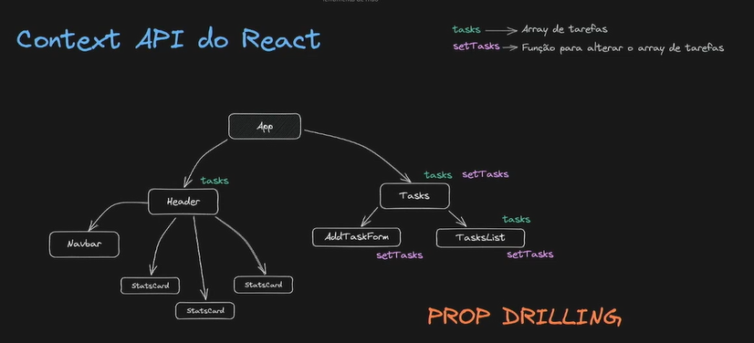
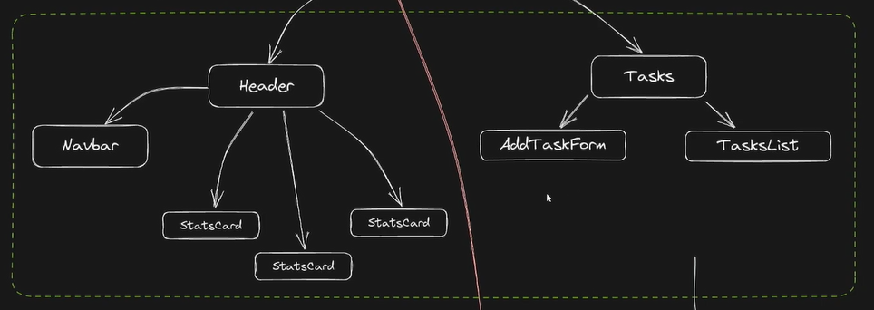

# React II: Componentes Funcionais e Hooks

## React Funcional I - Componentes Funcionais e Estilização

### Componentes Funcionais no React.js

Os componentes funcionais são uma das formas de definir componentes no React.js. Eles são definidos como funções JavaScript que podem aceitar propriedades como parâmetros e retornar elementos React para renderização.

#### Para que servem?

1. **Simplicidade e Legibilidade:** Componentes funcionais são mais simples de escrever e geralmente possuem um código mais limpo e fácil de entender.
   
2. **Performance:** Por não terem o overhead de criar uma instância de classe como os componentes baseados em classes, os componentes funcionais podem ser mais rápidos para renderizar.

3. **Encapsulamento de Lógica:** Com a introdução dos Hooks no React (como o useState e useEffect), é possível encapsular estado e comportamento dentro de componentes funcionais, promovendo a reutilização de lógica entre componentes.

#### Como aplicar componentes funcionais?

Para criar um componente funcional em React.js, basta definir uma função que retorna JSX (JavaScript XML). Aqui está um exemplo básico de um componente funcional que exibe um texto simples:

```jsx
import React from 'react';

const MeuComponenteFuncional = () => {
  return (
    <div>
      <h1>Olá, Mundo!</h1>
      <p>Este é um exemplo de componente funcional em React.</p>
    </div>
  );
}

export default MeuComponenteFuncional;
```

No exemplo acima:
- `MeuComponenteFuncional` é uma função que retorna JSX.
- `React` é importado para que o código JSX seja transformado adequadamente.
- `export default` torna o componente disponível para ser importado e utilizado em outros lugares do código.

#### Como funcionam os componentes funcionais?

1. **Renderização:** Quando um componente funcional é renderizado, o React chama a função definida e renderiza o JSX retornado pela função.

2. **Estado e Ciclo de Vida:** Antes da introdução dos Hooks, os componentes funcionais não podiam gerenciar estado interno ou ciclo de vida. Com os Hooks, como `useState` e `useEffect`, os componentes funcionais agora podem gerenciar estado local efeitos secundários.

3. **Reatividade:** Componentes funcionais são reativos por natureza no React, o que significa que qualquer mudança no estado ou propriedades que afete a saída do componente resultará em uma atualização automática da interface do usuário.

Os componentes funcionais têm ganhado popularidade devido à sua simplicidade e à introdução dos Hooks, que tornaram possível encapsular mais lógica em componentes funcionais sem a necessidade de classes.

Para mais informações sobre como usar Hooks ou criar componentes funcionais avançados, consulte a documentação oficial do React em [React Docs](https://reactjs.org/docs/getting-started.html).

### Projeto To-do List
[To-do List](https://whimsical.com/mytodo-K6yrqHmjiKpPz16gm4kcGP)


### CSS Padrão vs CSS Modules

#### CSS Padrão

O CSS padrão é a forma tradicional de escrever estilos para páginas web. Nele, você cria seletores de estilo que podem ser aplicados globalmente a todos os elementos de uma página ou de forma específica a elementos individuais. Aqui estão os pontos principais sobre o CSS padrão:

**Como utilizar**

1. **Seletores Globais:** Você define estilos que podem afetar todos os elementos correspondentes na página.
   
   Exemplo:
   ```css
   body {
     font-family: Arial, sans-serif;
     background-color: #f0f0f0;
   }
   ```

2. **Seletores Específicos:** Você também pode aplicar estilos a elementos específicos usando seletores de classe, ID ou tipo.
   
   Exemplo:
   ```css
   .botao {
     background-color: #007bff;
     color: #fff;
     padding: 10px 20px;
     border: none;
     cursor: pointer;
   }
   ```

**Vantagens**

- **Simplicidade:** É fácil começar a escrever estilos diretamente no arquivo CSS.
  
- **Familiaridade:** Muitos desenvolvedores estão familiarizados com CSS padrão devido à sua longa história e uso generalizado.

**Desvantagens**

- **Escopo Global:** Os estilos definidos podem ter escopo global, o que pode causar conflitos entre estilos em grandes projetos.
  
- **Nomeclatura:** A nomeclatura de classes pode se tornar complexa para evitar conflitos e para manter um código organizado.

**CSS Modules**

CSS Modules são uma abordagem para resolver os problemas de escopo global e nomeclatura do CSS padrão, permitindo uma melhor encapsulação de estilos para componentes individuais em aplicações web. Aqui estão os pontos principais sobre CSS Modules:

**Como utilizar**

1. **Encapsulação de Estilos:** Cada arquivo CSS Module é tratado como um escopo isolado. Isso significa que os seletores de classe dentro de um módulo não colidirão com seletores de outros módulos ou do CSS global.

   Exemplo de arquivo CSS Module (`MeuComponente.module.css`):
   ```css
   .botao {
     background-color: #007bff;
     color: #fff;
     padding: 10px 20px;
     border: none;
     cursor: pointer;
   }
   ```

2. **Importação em Componentes:** No componente React, você importa os estilos do arquivo CSS Module e aplica as classes diretamente aos elementos JSX.

   Exemplo de uso em um componente React:
   ```jsx
   import React from 'react';
   import styles from './MeuComponente.module.css';

   const MeuComponente = () => {
     return (
       <button className={styles.botao}>Clique Aqui</button>
     );
   }

   export default MeuComponente;
   ```

**Vantagens**

- **Escopo Local:** Evita conflitos de estilo usando escopos locais para classes, garantindo que os estilos sejam aplicados apenas aos componentes específicos que os importam.
  
- **Nomeclatura Simplificada:** Não há necessidade de se preocupar com conflitos de nomeclatura global, pois cada arquivo CSS Module possui seu próprio escopo.

- **Manutenção:** Facilita a manutenção de estilos, já que cada componente tem seus próprios estilos encapsulados.

**Desvantagens**

- **Curva de Aprendizado:** Pode haver uma pequena curva de aprendizado para entender como importar e usar corretamente os CSS Modules em componentes React.

- **Configuração:** É necessário configurar o ambiente de desenvolvimento para suportar CSS Modules, embora a maioria dos projetos modernos (como Create React App) já forneça suporte nativo.

Tanto o CSS padrão quanto os CSS Modules têm seus usos e vantagens. O CSS padrão é simples e amplamente conhecido, enquanto os CSS Modules oferecem uma solução mais robusta e segura para aplicações modernas, especialmente aquelas que utilizam frameworks como React.js. Escolher entre um e outro depende das necessidades específicas do projeto e da preferência da equipe de desenvolvimento.

## React Funcional II - Hook de estado

### Hooks

Hooks são uma nova adição no React 16.8. Eles permitem que você use o state e outros recursos do React sem escrever uma classe.

Hooks são retrocompatíveis. Esta página fornece uma visão geral de Hooks para usuários experientes em React. Esta é uma visão geral rápida.


[Hooks de forma resumida](https://pt-br.legacy.reactjs.org/docs/hooks-overview.html)

### Utilizando o useState de Maneira Funcional no React.js

O `useState` é um hook fundamental do React que permite adicionar o estado local a componentes funcionais. Ele é utilizado para armazenar valores que podem mudar ao longo do tempo e atualizar a interface do usuário conforme essas mudanças ocorrem.

#### O que é o useState?

O `useState` é uma função fornecida pelo React que permite adicionar estado a componentes funcionais. Antes dos hooks, apenas componentes de classe podiam ter estado local. Com a introdução dos hooks no React 16.8, agora é possível utilizar funcionalidades de componentes de classe, como o estado, em componentes funcionais.

#### Importância do useState

- **Simplicidade**: Permite o uso de estado sem a necessidade de converter um componente funcional em uma classe.
- **Legibilidade**: Deixa o código mais limpo e conciso.
- **Performance**: Ajuda a evitar o uso excessivo de classes e melhora a performance de renderização.

#### Como Utilizar o useState de Maneira Funcional

Para utilizar o `useState` de maneira funcional, siga os passos abaixo:

1. **Importar o Hook**:
   ```javascript
   import React, { useState } from 'react';
   ```

2. **Inicializar o Estado**:
   ```javascript
   const [estado, setEstado] = useState(valorInicial);
   ```
   - `estado`: Variável que armazena o valor atual do estado.
   - `setEstado`: Função que permite atualizar o estado.

   `useState` retorna um array com dois elementos:
   - O primeiro elemento (`estado`) é o valor atual do estado.
   - O segundo elemento (`setEstado`) é uma função para atualizar o estado.

3. **Exemplo de Uso**:
   ```javascript
   import React, { useState } from 'react';

   function Contador() {
       const [contador, setContador] = useState(0);

       const incrementar = () => {
           setContador(contador + 1);
       };

       return (
           <div>
               <p>Contagem: {contador}</p>
               <button onClick={incrementar}>Incrementar</button>
           </div>
       );
   }

   export default Contador;
   ```
   - Neste exemplo, `contador` é o estado inicializado com `useState(0)`. 
   - `setContador` é usado para atualizar o valor de `contador` quando o botão é clicado.

Utilizar o `useState` de maneira funcional no React simplifica a gestão de estado em componentes funcionais. Isso melhora a legibilidade do código e ajuda na manutenção do estado local dentro do componente. Sempre que precisar rastrear e atualizar valores que mudam ao longo do tempo em um componente funcional, o `useState` é a ferramenta ideal para utilizar.

## React Funcional III - Hook de efeito
### Utilizando o useEffect de Maneira Funcional no React.js

O `useEffect` é um dos hooks mais poderosos do React, usado para realizar efeitos colaterais em componentes funcionais. Esses efeitos colaterais podem incluir operações de leitura/gravação de dados, assinaturas de eventos, manipulação do DOM, entre outros.

#### O que é o useEffect?

O `useEffect` é um hook do React que permite executar efeitos colaterais em componentes funcionais. Ele atua como o equivalente funcional dos métodos de ciclo de vida (`componentDidMount`, `componentDidUpdate`, `componentWillUnmount`) em componentes de classe.

#### Importância do useEffect

- **Execução de Efeitos Colaterais**: Permite executar código que precisa ocorrer após a renderização do componente, como requisições HTTP, manipulação do DOM, inscrições em eventos, etc.
- **Substituição dos Métodos de Ciclo de Vida**: Com a introdução dos hooks, o `useEffect` substituiu a necessidade de usar métodos de ciclo de vida em componentes de classe.
- **Organização e Separação de Responsabilidades**: Ajuda a manter a lógica de efeitos colaterais separada da lógica de renderização do componente, facilitando a compreensão e a manutenção do código.

#### Como Utilizar o useEffect de Maneira Funcional

Para utilizar o `useEffect` de maneira funcional, siga os passos abaixo:

1. **Importar o Hook**:
   ```javascript
   import React, { useEffect } from 'react';
   ```

2. **Definir o Efeito Colateral**:
   ```javascript
   useEffect(() => {
       // Código a ser executado após a renderização do componente
   }, [dependencias]);
   ```
   - A função passada para `useEffect` é o efeito colateral que será executado após a renderização do componente.
   - O segundo argumento é um array opcional de dependências. Se especificado, o efeito será executado apenas se alguma das dependências mudar entre renderizações.

3. **Exemplos de Uso**:

   - **Executando uma Requisição HTTP**:
     ```javascript
     useEffect(() => {
         axios.get('https://api.example.com/data')
             .then(response => {
                 // Processar os dados recebidos
             })
             .catch(error => {
                 // Lidar com erros
             });
     }, []);
     ```
     - Neste exemplo, a requisição HTTP é realizada apenas uma vez após a montagem do componente (`componentDidMount`).

   - **Inscrição em um Evento**:
     ```javascript
     useEffect(() => {
         window.addEventListener('resize', handleResize);

         return () => {
             window.removeEventListener('resize', handleResize);
         };
     }, []);
     ```
     - Aqui, `handleResize` é uma função que será chamada quando o evento de redimensionamento da janela ocorrer. O retorno da função dentro de `useEffect` é opcional e permite a limpeza de recursos quando o componente é desmontado (`componentWillUnmount`).

#### Considerações Finais

O `useEffect` é essencial para lidar com efeitos colaterais em componentes funcionais no React. Ele oferece flexibilidade e poder, permitindo que você execute código de forma assíncrona após as renderizações, mantendo seu componente limpo e organizado. Ao utilizá-lo corretamente, você pode melhorar a performance e a manutenibilidade de seus aplicativos React.

## React Funcional IV - Hooks de referência

1. Um hook que nos permite fazer referência a um valor que não precisa de re-renderização quando é atualizado.
2. Persiste o valor da variável, mesmo quando o componente é re-renderizado.
3. É communmente utilizado para acessar elementos do DOM. 
### Funcionamento do `useRef`
```javascript
const ref = useRef(initialValue)
```
- `initialValue`: o valor que será atribuído à propriedade `current` do objeto retornado pelo `useRef`
- O `useRef` retorna um objeto com uma propriedade `current`, que corresponde o valor que foi atribuído no `initialValue`. Se você passar uma ref para um alemento HTML o React irá atribuir aquele elemento para o current da ref de forma automática.


Hooks de referência no React são uma forma de interagir diretamente com elementos do DOM dentro de componentes funcionais. Eles permitem que você acesse e manipule elementos HTML de forma imperativa, o que é útil para casos como foco de inputs, medição de elementos ou integração com bibliotecas de terceiros que requerem acesso direto ao DOM.

### Principais Hooks de Referência

1. **useRef**: O `useRef` é o hook de referência principal no React. Ele cria um objeto de referência mutável que persiste durante todo o ciclo de vida do componente. O objeto `current` retornado por `useRef` pode ser usado para acessar diretamente o elemento do DOM correspondente a um componente ou para armazenar qualquer valor mutável.

   Exemplo de uso básico:
   ```javascript
   import React, { useRef, useEffect } from 'react';

   function TextInputWithFocusButton() {
       const inputRef = useRef(null);

       useEffect(() => {
           // Focus no input quando o componente é montado
           inputRef.current.focus();
       }, []);

       return (
           <>
               <input ref={inputRef} type="text" />
               <button onClick={() => inputRef.current.focus()}>Focar Input</button>
           </>
       );
   }

   export default TextInputWithFocusButton;
   ```
   Neste exemplo, `inputRef` é uma referência que pode ser usada para acessar o input diretamente através de `inputRef.current`.

2. **useImperativeHandle**: O `useImperativeHandle` é usado para customizar a instância de um ref exposta para o pai do componente. Ele permite controlar quais métodos ou propriedades são visíveis no ref quando acessado pelo componente pai.

   Exemplo de uso:
   ```javascript
   import React, { useRef, useImperativeHandle, forwardRef } from 'react';

   const FancyInput = forwardRef((props, ref) => {
       const inputRef = useRef();

       useImperativeHandle(ref, () => ({
           focus: () => {
               inputRef.current.focus();
           },
           blur: () => {
               inputRef.current.blur();
           }
       }));

       return <input ref={inputRef} />;
   });

   // Uso do FancyInput em outro componente
   function ParentComponent() {
       const fancyInputRef = useRef();

       const handleFocusClick = () => {
           fancyInputRef.current.focus();
       };

       return (
           <>
               <FancyInput ref={fancyInputRef} />
               <button onClick={handleFocusClick}>Focar Input</button>
           </>
       );
   }

   export default ParentComponent;
   ```
   Neste exemplo, `useImperativeHandle` personaliza quais métodos (`focus` e `blur`) são expostos através do ref do `FancyInput`, permitindo que o componente pai (`ParentComponent`) controle o foco do input.

### Importância dos Hooks de Referência

- **Acesso Imperativo ao DOM**: Permitem a manipulação direta de elementos do DOM de forma segura e declarativa dentro de componentes funcionais.
- **Integração com APIs Existentes**: Facilitam a integração com bibliotecas e plugins que dependem de acesso direto ao DOM.
- **Melhoria de Performance**: Evitam a necessidade de usar métodos de ciclo de vida como `componentDidMount` e `componentDidUpdate` para manipulações de DOM simples.

Os hooks de referência são uma poderosa adição ao arsenal do React, permitindo maior flexibilidade e controle em componentes funcionais, enquanto mantêm a simplicidade e a eficiência que são características fundamentais da biblioteca.


## React Funcional V - Hooks de memoização `useMemo` e `useCallback`
***Memoização*, que é isso?**
A memoização é uma técnica poderosa que ajuda a acelerar o desempenho de funções complexas. Basicamente, ela guarda os resultados que já calculamos, evitando cálculos repetitivos. Imagine isso como anotar respostas em um caderno para evitar ter que fazer a mesma pergunta várias vezes.
Na prática, guardamos as respostas das funções em uma estrutura de dados ou arquivo, geralmente um dicionário, cuja chave seja o hash dos valores de entrada e o valor seja o resultado da computação feita. Quando chamamos a função novamente com os mesmos "ingredientes", em vez de fazer todo o processo novamente, simplesmente verificamos nosso arquivo. Se a resposta já estiver lá, pegamos a resposta pronta, economizando um tempo precioso. É como ter uma receita pronta sempre que precisamos.

### `useMemo`
- É um hook que nos permite memorizar o resultado de um cálculo guardado em uma variável mesmo que ocorra um re-renderização do componente.
- Recebe 2 parâmetros:
    - Função que retorna o valor a ser memorizado.
    - Array de dependências: sempre que uma das variáveis passadas no array for alterada, a função que calcula e retorna o valor novamente.
- Retorna o valor a ser cacheado, que corresponde ao valor retornado pela função (primeiro parâmetro).

### `useCallback`
- É um hook que nos permite memorizar a definição de uma função entre re-renderizações.
- Recebe dois parâmetros:
    - Função cuja definição será cacheada(to cache).
    - Array de dependências: um array contendo todas as variárvies das quais a função depende.

```typescript
Observe que o `useCallback` memoriza a definição da função, não a execução. Ou seja, a função será executada sempre que for chamada no código. Ela apenas não será "recriada" quando o componente atualizar. Tendo isso em vista, o `useCallback` não irá trazer beneficíos se a função realizar um processamento complexo.
```

## React Funcional VI - Hooks de contexto



**Prop drilling** (isso é analogo a um problema)

Em aplicações React, os componentes frequentemente precisam receber dados para renderizar corretamente. Esses dados são passados como props de um componente pai para um componente filho. O prop drilling ocorre quando os dados são passados através de vários níveis de componentes intermediários que não têm um uso direto desses dados, apenas para que eles possam ser acessados por um componente mais profundo na hierarquia.

Embora o prop drilling seja uma técnica válida e simples de implementar, pode tornar o código mais difícil de manter e entender, especialmente em aplicações com muitos componentes aninhados. Para mitigar isso, muitos desenvolvedores optam por usar ferramentas como React Context API ou bibliotecas de gerenciamento de estado (como Redux ou MobX), que permitem compartilhar dados globalmente na aplicação sem a necessidade de passá-los manualmente através de todos os componentes intermediários.

### Context API

A Context API é uma característica do React que foi introduzida para facilitar o compartilhamento de dados que são necessários por muitos componentes diferentes na árvore de componentes de uma aplicação React, sem a necessidade de passá-los manualmente através de props em cada nível.

### Funcionalidades Principais da Context API:

1. **Contexto (Context)**: O contexto em si é um objeto do React que fornece uma forma de compartilhar valores, como dados globais, entre componentes da árvore de componentes sem precisar passar props manualmente de componente para componente.

2. **Provider e Consumer**: O Context API fornece dois principais componentes, o `Provider` e o `Consumer`. O `Provider` permite que os componentes filhos se inscrevam para receber os valores do contexto, enquanto o `Consumer` permite que os componentes filhos consumam esses valores.

3. **Redução de Prop Drilling**: Utilizando o Context API, é possível reduzir ou eliminar o prop drilling ao centralizar o estado da aplicação ou quaisquer outros dados que precisam ser compartilhados em um contexto. Dessa forma, os componentes que precisam desses dados podem acessá-los diretamente através do Consumer, sem a necessidade de passá-los manualmente através de todos os níveis intermediários.

### Exemplo de Uso Básico:

```jsx
import React, { createContext, useContext } from 'react';

// Criando um contexto
const MyContext = createContext();

// Um componente que fornece o contexto
const MyProvider = ({ children }) => {
  const sharedValue = 'Hello from Context!';

  return (
    <MyContext.Provider value={sharedValue}>
      {children}
    </MyContext.Provider>
  );
};

// Um componente que consome o contexto
const ChildComponent = () => {
  const valueFromContext = useContext(MyContext);

  return <p>{valueFromContext}</p>;
};

// Exemplo de uso na aplicação principal
const App = () => {
  return (
    <MyProvider>
      <div>
        <h1>Componente Principal</h1>
        <ChildComponent />
      </div>
    </MyProvider>
  );
};

export default App;
```

Neste exemplo simplificado, `MyProvider` define o contexto com um valor (`sharedValue`). `ChildComponent` consome este contexto utilizando o hook `useContext(MyContext)`, permitindo que ele acesse e utilize `sharedValue` diretamente.

- **Simplicidade**: Facilita o compartilhamento de estado entre componentes sem passar props manualmente através de múltiplos níveis.
  
- **Escalabilidade**: Ajuda na gestão de estado global de forma mais organizada, especialmente em aplicações grandes com muitos componentes.

- **Performance**: A Context API é otimizada pelo React para atualizações de componentes que consomem contexto, melhorando a performance em comparação com outras soluções alternativas.

Ela é uma ferramenta poderosa para lidar com o compartilhamento de estado e dados entre componentes no React, especialmente em cenários onde o prop drilling se tornaria impraticável ou difícil de manter.


