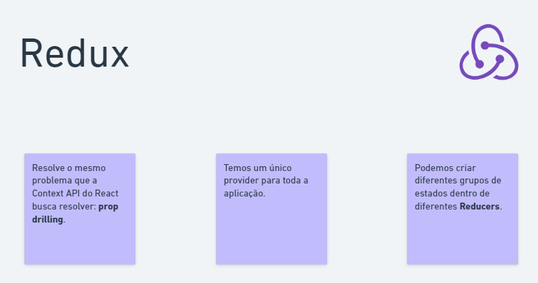
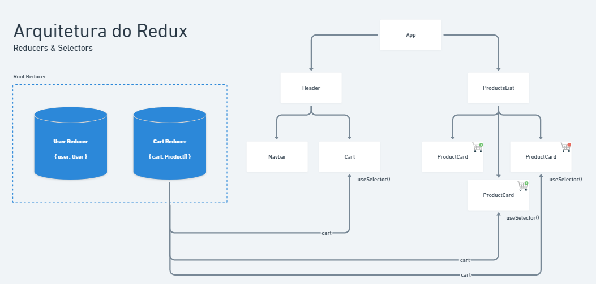
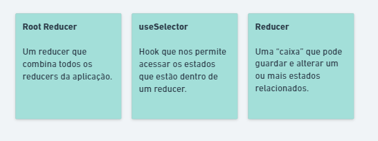
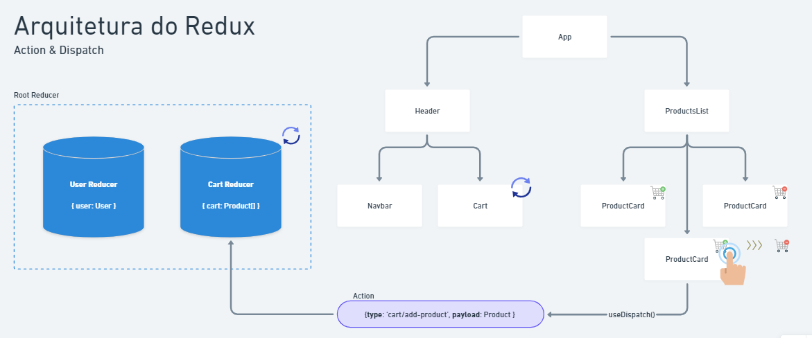
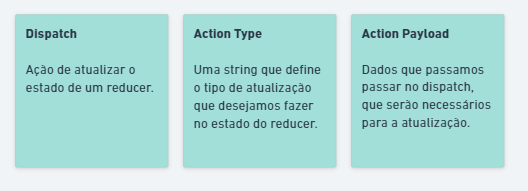
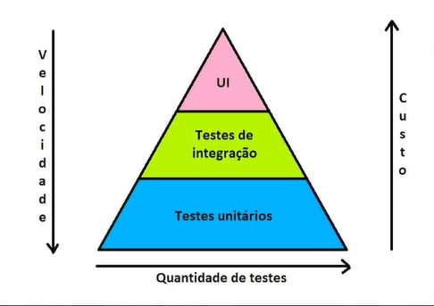
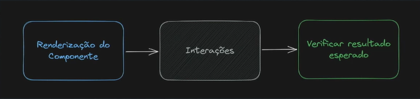
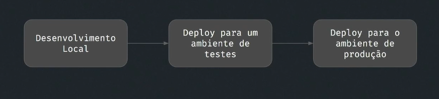

# Styled Components & Redux

## React + Styled Components I

Dados da API fakestoreApi
[All products](https://fakestoreapi.com/products)

# Redux
[Redux - Aula ](https://whimsical.com/redux-VRMDFyyXby3WaZ3n8uTEGB)

  

  

# Testes e Deployment

## Testes unitários I
**Introdução**
- Testes automatizados: um recurso utilizado para automatizar a tarefa de revisar e validar um software.
- Vantagens:
  - Permitem identificar erros/bugs no sistema.
  - Incentivam a utilização de boas práticas na escrita do código.
  - Promove uma maior confiança no momento da adição/alteração do código para todos os desenvolvedores de um time.
- Requisito essencial para garantir a qualidade do sistema desenvolvido pela empresa.

### Tipos de testes
**Testes unitários**
- Têm por objetivo testar as menores unidades do software de forma isolada.
- As "unidades" de um sistema podem ser entendidas como os componentes da aplicação, no caso do React.
- Deseja-se garantir que os componentes apresentam o comportamento esperado quando utilizados de forma isolada.
- Geralmente têm um baixo custo para automatização e podem ser executados rapidamente, inclusive por um servidor de integração contínua.

**Testes de integração**
- São utilizados para garantir o bom funcionamento quando as unidades do sistema interagem entre si.
- No React, podemos considerar um teste de integração quando testamos dois ou mais componentes ao mesmo tempo.
- Normalmente, criamos os testes de integração após os testes unitários.
São mais complexos e demoram mais tempo para serem executados.

**Testes E2E**
- Os testes de ponta a ponta visam testar um comportamento da aplicação (fluxo completo).
- Simulam as ações que o usuário realizaria na aplicação e é realizado quando a aplicação está rodando em um ambiente semelhante ao de produção, sendo os últimos testes a serem executados.
- A ideia é garantir o bom funcionamento de fluxos que não podem apresentar falhas.
- São os mais complexos, exigindo mais tempo para sua escrita e execução.

**Hierarquia de testes**

**Ferramentas de testes**
Usado em aula será o Jest e o Testing Library

- [Jest](https://jestjs.io/pt-BR/)
- [React Testing Library](https://testing-library.com/docs/react-testing-library/intro/)
- [Cypress](https://www.cypress.io/)

**Estrutura dos testes**

## Deployment 
**Introdução**
- Ao concluir a etapa de desenvolvimento da aplicação, garantindo que ela está pronta para ser utilizada pelo usuário final, podemos partir para a etapa de implantação da aplicação.
- O deploy se refere à etapa de implementação da aplicação, ou seja, ao processo disponibilizar o nosso projeto na web.
- O deploy nos permite levar aquilo que foi implementado no ambiente de desenvolvimento para o ambiente de produção

**Etapas do deploy**: Processos envolvidos no Deploy

1. **Preparação do ambiente**:
Esta etapa envolve garantir que o ambiente de produção esteja configurado corretamente para receber a nova versão do software. Isso pode incluir configuração de servidores, instalação de dependências e ajustes de variáveis de ambiente
2. **Build**:
Durante o build, o código fonte é compilado e transformado em uma versão executável ou distribuível. Isso pode envolver a transpilação de código, minificação de arquivos, entre outros processos de otimização
3. **Testes**:
Os testes são cruciais para garantir que o software funcione conforme o esperado. Isso inclui testes unitários, testes de integração e, possivelmente, testes de aceitação automatizados. A qualidade do software é verificada nesta fase para evitar problemas em produção.
4. **Configuração**:
Nesta etapa, todas as configurações necessárias para o funcionamento do software em produção são ajustadas. Isso pode incluir configurações de banco de dados, conexões de API, configurações de segurança, entre outros.
5. **Implantação**:
Durante a implantação, a versão construída e testada do software é colocada em produção. Isso pode ser feito de várias formas, como deploy contínuo, deploy manual ou por meio de ferramentas de automação. O objetivo é tornar o software acessível aos usuários finais
6. **Monitoramento**: Após a implantação, é essencial monitorar o software em produção para identificar problemas em tempo real, coletar métricas de desempenho e garantir que tudo esteja funcionando conforme o esperado. Isso ajuda a manter a estabilidade e a disponibilidade do sistema.

**Fluxo de desenvolvimento**: visando o ambiente de produção

**Deploy de uma Aplicação React** 

