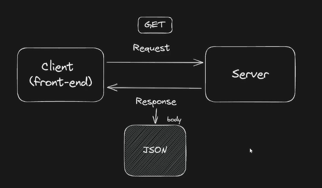

# Módulo 3 - TypeScript, POO e Browser APIs

## JSON -> JSON: JavaScript Object Notation

### O que é JSON?

JSON (JavaScript Object Notation) é um formato leve de troca de dados que é fácil de ler e escrever para humanos, além de ser fácil de interpretar e gerar para máquinas. Ele é baseado em um subconjunto da linguagem de programação JavaScript, embora seja independente de linguagem.

### Para que serve JSON?

JSON é amplamente utilizado para transmitir dados entre um servidor e um cliente na web. Ele serve como um formato comum para representar estruturas de dados complexas de maneira legível e organizada. Sua simplicidade e flexibilidade o tornam ideal para aplicações que necessitam de comunicação rápida e eficiente de dados.

### Importância do JSON

- **Legibilidade:** JSON é fácil de ler e entender para humanos, o que facilita a depuração e o desenvolvimento.
- **Interoperabilidade:** Funciona bem com diversas linguagens de programação, tornando-se uma escolha popular para integração de sistemas.
- **Estrutura Simples:** Permite representar estruturas de dados complexas de maneira organizada e hierárquica.
- **Eficiência:** É leve em termos de consumo de espaço e tempo de processamento, sendo ideal para transferência de dados via rede.

### Como usar JSON

#### Sintaxe Básica

Um objeto JSON é representado por pares chave/valor, onde as chaves são strings e os valores podem ser de qualquer tipo de dado suportado pelo JSON (string, número, objeto, array, booleano ou null). Exemplo:

```json
{
  "nome": "João",
  "idade": 30,
  "ativo": true,
  "endereço": {
    "rua": "Rua Principal",
    "cidade": "Exemplo City"
  },
  "telefones": ["123-456-7890", "987-654-3210"]
}
```
**Utilização em Aplicações**
- Leitura e Escrita: Linguagens de programação geralmente possuem bibliotecas nativas para ler e escrever JSON.
- Comunicação de Dados: Usado em APIs para transmitir dados entre cliente e servidor.
- Configuração: Arquivos de configuração frequentemente são escritos em JSON devido à sua simplicidade.

**Exemplo de Uso em JavaScript**
```
// Exemplo de leitura e manipulação de JSON em JavaScript

// String JSON
let dadosJSON = '{"nome": "Maria", "idade": 25}';

// Parse para objeto JavaScript
let dadosObjeto = JSON.parse(dadosJSON);

// Acesso aos dados
console.log(dadosObjeto.nome); // Saída: Maria

// Objeto JavaScript para JSON
let novoJSON = JSON.stringify(dadosObjeto);
console.log(novoJSON); // Saída: {"nome":"Maria","idade":25}

```

JSON é uma ferramenta poderosa para desenvolvedores web e de aplicativos, facilitando a troca e manipulação de dados de forma eficiente e compreensível.

### **Resumão** 
#### Introdução
- JSON, do inglês, JavaScript Object Notation (Notação de Objetos Javascript)
- É uma **formatação** leve de **troca de dados**.
- Para humanos: fácil de ler e escrever.
- Para máquinas: fácil de interpretar e gerar.
- Embora ele seja inspirado nos objetos do JavaScript, é um formato que **independe de linguaegem**.
- Utiliza convenções familiares a diferente linguagens de programção.
  - coleção de pares nome/valor (objeto, dicionário, record, struct...)
  - Lista ordenada de valores (array, lista, vertor, sequência...)
- Exemlpo de arquivo JSON:
```
{
  "id":1,
  "nome": "Julen Hurts",
  "posicao":"Quarterback",
  "idade":24,
  "altura:1.75,
  "mvp": true,
}
```
#### Vantagens
1. Fácil interpretação/leitura e escrita/geração.
2. Maior velocidade na execução e transporte de dados.
3. Arquivo com tamanho reduzido.
4. Fácil de realizar o parsing. É um nome técnico para você converter o JSON em um dado manipulável na linguagem de sua escolha.

#### Principais aplicações de JSON
1. Arquivos de configuração:
  - Configurações do VSCode
  - package.json
  - .prettier.json
  - .eslint.json
2. A transferência de dados entre aplicações: **API**


#### Lidando com JSON, em formato de string, para um objeto.

1. Lendo um arquivo JSON;
```
const fs = require("fs");

fs.readFile("../../../../../../../../Estudos/Ada/Ada - React/TypeScript, POO e Broweser APIs/Aulas/aula 1/teste/.prettierrc.json", (erro, dados) => {
  if(erro){
    console.log("Erro: ", erro);
  } else {
    // dados: Buffer com os dados do arquivo json
    const dadosD = JSON.parse(dados); // convertendo o buffer em um objeto do JS
    console.log(dadosD.semi)
    console.log(typeof dados);
  }
});
```
2. Convertendo JSON, em formato de string, para um objeto;
```
const jsonString =` { 
  "nome": "Bruno"
}`;

console.log(JSON.parse(jsonString))

```
3. Convertendo um objeto de JS, em um JSON (string);
```
const pessoa = {
  nome: "Peter park",
  papel: "Miranha"
}

console.log(JSON.stringify(pessoa))
```

## API: introdução

### Aplication programming interface
- Em português, intergace de programação de aplicações
- Hoje em dia é muito comum que diferentes aplicações consumam dados pela internet, muitas vezes dados providenciados por terceiro.
- Pro exemplo, um aplicativo de entrega de alimentos pode usar dados de geolocalização do Google para localizar restaurantes próximos ao usuário e exibir a rota percorrida pelo entregador. 
- Como essas aplicações podem estar rodando em diferentes plataformas e linguagens de programação, é importante estabelecer um "linguagem comum" para que todos consigam consumir esses dados.
- A API é uma interface que nos permite utilizar funcionalidades/recursos de terceiros, seguindo um conjunto de definições/contratos estabelecidos pelo terceiro.
- Exemplos:
  - Login social: facebook, google, twitter, github, etc.
  - Pagamento Online: pagarme, stripe, etc.
- A Api acaba facilitando a vida dos programadores, pois **reduz o tempo de desenvolvimento** de novas aplicações.

#### Tipos de APIs
1. Públicas ou abertas: geralmente as gratúitas
2. Privadas ou internas: em situações que precisam de keys, authentication, etc.
3. APIs de Parceiros

#### Protocolos de APIs
- Os protocolos servem para padronizar a troca de dados entre a aplicação e a API.
- Existem diferentes protocolos de APIs, como RPC, SOAP, GraphQL e REST.
- O REST é o padrão mais comum.
- REST(Representational State Transfer) se baseia em seis restrições. Caso um API respeite essas 6 restrições, ela é considerada uma API RESTfull.

#### Quais são essas 6 restrições
1. Ter uma arquitetura formada por clientes, servidores e recursos, com solicitações gerenciadas por HTTP.
2. Estabelecer uma comunicação **stateless** entre cliete e servidor.
Isso significa que nenhuma informação do cliente é armazenada entre solicitações GET etodas as solicitações são separadas e desconectadas.
3. Armazenar dados em cache para otimizar as interações entre cliente e servidor.
4. Ter uma interface uniforme entre os componentes para que as informações sejam transferidas em um formato padronizado.
5. Ter um sistema em camadas que organiza os tipos de servidores (responsáveis pela segurança, pelo carregamento de carga e assim por diante) envolvidos na recuperação das informações solicitadas em hierarquias que o cliente não pode ver.
6. Possibilitar código sob demanda (opcional): a capacidade de enviar um código executável do servidor para o cliente quando solicitado para ampliar a funcionalidade disponível ao cliente.

### Características de APIs REST
- Os recursos são solicitados/enviados via protocolo HTTP
- **URI (Base URL)**: Várias APIs fornecem um "endereço base". TOdas as suas requisições incluirão esse endereço, e ao final dele nós colocamos detalhes específicos para cada um dos recursos disponíveis.
- **Formato do dado/recurso**: Algumas APIs possuem formatos fixos de dados. Outras permitem que você escolha. É comum, por exemplo, que uma API permita que você escolha entre JSON, XML, CSV e/ou outros formatos.
- Schemas: é bastante comum que as APIs disponibilizem um "modelo" genérico de como será formatado o seu JSON para que os desenvolvedores saibam quais campos esperar e quais tipos de dados serão possíveis para cada campo. Por exemplo:
```
{
  "nome": string,
  "pontuacao": integer
}
```
- **Autenticação**: Outro aspecto importante é a autenticação. Enquanto algumas APIs grátis/abertas, outras são pagas. Ainda temos algumas híbridas (é possível acessar gratuitamente certos recursos, ou consumir um certo volume de dados, e acima disso você deverá pagar).
  a. Os dois modelos mais comuns de autenticação:
    1. Chave: ao fazer seu registro, você recebe uma chave que deverá ser passada na requisição.
    2. OAuth: um esquema um pouco mais complexo onde são combinados códigos de autorização, identificação do cliente e segredo do cliente em um POST, e o servidor cria uma sessão por um tempo limitado e fornece o ID da mesma. APIs de gigantes da internet (como Google e Facebook) costumam usar esse modelo.
- **Endpoint**: A URL que deve ser acessada a fim de obter um recurso específico.
  a. Dictionary API:
    [Hello - en](https://api.dictionaryapi.dev/api/v2/entries/en/hello)
  b. OpenWeather API:
    [https://api.openweathermap.org/data/2.5/wheater?lat={lat}&lon={lon}&appid={API KEY}](https://api.openweathermap.org/data/2.5/wheater?lat={lat}&lon={lon}&appid={API%20KEY})

#### Exemplos de APIs de terceiros
-  [PokeAPI](https://pokeapi.co/)
- [GitHubAPI](https://docs.github.com/pt/rest?apiVersion=2022-11-28)
- [OpenWeatherAPI](https://openweathermap.org/current)
  meu user: [Brinu](https://api.github.com/users/brunoandradedinis)
- [Publics APIs](https://github.com/public-apis/public-apis)

#### Como testar APIs?
1. Leia a  documentação
2. Teste no navegador o/
3. Use Softwares: 
  - [Postman](https://www.postman.com/)
  - [Insomnia](https://insomnia.rest/download)

#### Existem outros tipos de APIs?
**APIs do Browser**
1. Documente API
2. Notifications API
3. Web Storage API
4. **Fetch API**

## Consumo de API
- [ViaCep](https://viacep.com.br/)
- [DummyAPI.io (caiu)](https://dummyapi.io/)
- [FakeStore API](https://fakestoreapi.com/)

## Typescript I
Claro! Aqui está o conteúdo em formato Markdown:

---

### TypeScript: O que é, como funciona e como usar

#### O que é TypeScript?
*JavaScript com sintaxe para tipos*, o TypeScript é uma linguagem de programação desenvolvida pela Microsoft que adiciona recursos de tipagem estática opcional ao JavaScript. Isso significa que você pode definir tipos para suas variáveis, parâmetros de função e retornos de função, o que ajuda a capturar erros de tipo durante o desenvolvimento.

#### Como funciona o TypeScript?

O TypeScript funciona como um superconjunto de JavaScript, o que significa que qualquer código JavaScript válido também é válido em TypeScript. O código TypeScript é compilado para JavaScript simples antes de ser executado. Durante a compilação, o TypeScript verifica tipos e realiza outras transformações de código conforme necessário.

### Como usar TypeScript?

#### Instalação

Para começar a usar TypeScript, você precisa instalar o TypeScript Compiler (`tsc`) globalmente via npm (Node Package Manager). Você pode fazer isso executando o seguinte comando no seu terminal:

```bash
npm install -g typescript
```

#### Criando um arquivo TypeScript

1. **Criar um arquivo TypeScript**: Crie um arquivo com a extensão `.ts` (por exemplo, `hello.ts`).

2. **Escrever código TypeScript**:
   
   ```typescript
   function greet(name: string) {
       console.log(`Hello, ${name}!`);
   }

   let user = "Alice";
   greet(user);
   ```

   Neste exemplo, `name: string` indica que `name` deve ser uma string. TypeScript verifica isso durante a compilação.

3. **Compilar o código TypeScript**: No terminal, execute o seguinte comando para compilar seu arquivo TypeScript:

   ```bash
   tsc hello.ts
   ```

   Isso irá gerar um arquivo JavaScript correspondente (`hello.js`).

4. **Executar o arquivo JavaScript**: Você pode então executar o arquivo JavaScript gerado normalmente:

   ```bash
   node hello.js
   ```

#### Recursos do TypeScript

- **Tipagem estática opcional**: Permite definir tipos para variáveis, parâmetros de função e retornos de função para capturar erros de tipo em tempo de compilação.
  
- **Compatibilidade**: Como TypeScript é um superconjunto de JavaScript, você pode utilizar qualquer biblioteca JavaScript existente diretamente no seu código TypeScript.

- **Ferramentas de desenvolvimento**: TypeScript é integrado com diversas ferramentas de desenvolvimento como VS Code, proporcionando suporte avançado para autocompletar, refatoração e detecção de erros.

TypeScript é uma excelente escolha para desenvolvedores que desejam aumentar a segurança e a manutenibilidade de seus projetos JavaScript. Com sua tipagem estática opcional e a capacidade de compilar para versões mais antigas de JavaScript, TypeScript oferece uma forma poderosa de escrever código mais robusto e escalável.

Para mais informações e detalhes, consulte a [documentação oficial do TypeScript](https://www.typescriptlang.org/).

---
**Vantagens**
- Types
- Utilização de um JS mais recente (compilado para funcionar em browsers mais antigos)
- Adiciona novos recursos, que não existem no JS (ex: Interfaces e Generics)
- Muitas opções de configurações
- Melhores sugestôes de código em IDEs que têm um suporte melhorado ao TS
```
Utilizado em projetos ReactJS e ja vem instalado no Angular
```

![Imagem]](image-1.png)
- O TS só vai servir para o momento que estivermos realizando o desenvolvimento, depois a gente não vai utiliza-lo no servidor para o rodar com o app, ele só vai transpilar/compilar tudo para JS.

## Typescript II


## Programção Orientada a Objetos


## Browser API I


## Browser API II


## Projeto JS: Lista de tarefas


## Projeto JS: Condições do Tempo
