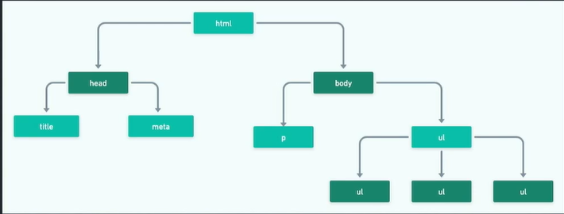

# Módulo 3 - TypeScript, POO e Browser APIs

## JSON -> JSON: JavaScript Object Notation

### O que é JSON?

JSON (JavaScript Object Notation) é um formato leve de troca de dados que é fácil de ler e escrever para humanos, além de ser fácil de interpretar e gerar para máquinas. Ele é baseado em um subconjunto da linguagem de programação JavaScript, embora seja independente de linguagem.

### Para que serve JSON?

JSON é amplamente utilizado para transmitir dados entre um servidor e um cliente na web. Ele serve como um formato comum para representar estruturas de dados complexas de maneira legível e organizada. Sua simplicidade e flexibilidade o tornam ideal para aplicações que necessitam de comunicação rápida e eficiente de dados.

### Importância do JSON

- **Legibilidade:** JSON é fácil de ler e entender para humanos, o que facilita a depuração e o desenvolvimento.
- **Interoperabilidade:** Funciona bem com diversas linguagens de programação, tornando-se uma escolha popular para integração de sistemas.
- **Estrutura Simples:** Permite representar estruturas de dados complexas de maneira organizada e hierárquica.
- **Eficiência:** É leve em termos de consumo de espaço e tempo de processamento, sendo ideal para transferência de dados via rede.


### Como usar JSON

#### Sintaxe Básica

Um objeto JSON é representado por pares chave/valor, onde as chaves são strings e os valores podem ser de qualquer tipo de dado suportado pelo JSON (string, número, objeto, array, booleano ou null). Exemplo:

```json
{
  "nome": "João",
  "idade": 30,
  "ativo": true,
  "endereço": {
    "rua": "Rua Principal",
    "cidade": "Exemplo City"
  },
  "telefones": ["123-456-7890", "987-654-3210"]
}
```
**Utilização em Aplicações**
- Leitura e Escrita: Linguagens de programação geralmente possuem bibliotecas nativas para ler e escrever JSON.
- Comunicação de Dados: Usado em APIs para transmitir dados entre cliente e servidor.
- Configuração: Arquivos de configuração frequentemente são escritos em JSON devido à sua simplicidade.

**Exemplo de Uso em JavaScript**
```
// Exemplo de leitura e manipulação de JSON em JavaScript

// String JSON
let dadosJSON = '{"nome": "Maria", "idade": 25}';

// Parse para objeto JavaScript
let dadosObjeto = JSON.parse(dadosJSON);

// Acesso aos dados
console.log(dadosObjeto.nome); // Saída: Maria

// Objeto JavaScript para JSON
let novoJSON = JSON.stringify(dadosObjeto);
console.log(novoJSON); // Saída: {"nome":"Maria","idade":25}

```

JSON é uma ferramenta poderosa para desenvolvedores web e de aplicativos, facilitando a troca e manipulação de dados de forma eficiente e compreensível.

### **Resumão** 
#### Introdução
- JSON, do inglês, JavaScript Object Notation (Notação de Objetos Javascript)
- É uma **formatação** leve de **troca de dados**.
- Para humanos: fácil de ler e escrever.
- Para máquinas: fácil de interpretar e gerar.
- Embora ele seja inspirado nos objetos do JavaScript, é um formato que **independe de linguaegem**.
- Utiliza convenções familiares a diferente linguagens de programção.
  - coleção de pares nome/valor (objeto, dicionário, record, struct...)
  - Lista ordenada de valores (array, lista, vertor, sequência...)
- Exemlpo de arquivo JSON:
```
{
  "id":1,
  "nome": "Julen Hurts",
  "posicao":"Quarterback",
  "idade":24,
  "altura:1.75,
  "mvp": true,
}
```
#### Vantagens
1. Fácil interpretação/leitura e escrita/geração.
2. Maior velocidade na execução e transporte de dados.
3. Arquivo com tamanho reduzido.
4. Fácil de realizar o parsing. É um nome técnico para você converter o JSON em um dado manipulável na linguagem de sua escolha.

#### Principais aplicações de JSON
1. Arquivos de configuração:
  - Configurações do VSCode
  - package.json
  - .prettier.json
  - .eslint.json
2. A transferência de dados entre aplicações: **API**


#### Lidando com JSON, em formato de string, para um objeto.

1. Lendo um arquivo JSON;
```
const fs = require("fs");

fs.readFile("../../../../../../../../Estudos/Ada/Ada - React/TypeScript, POO e Broweser APIs/Aulas/aula 1/teste/.prettierrc.json", (erro, dados) => {
  if(erro){
    console.log("Erro: ", erro);
  } else {
    // dados: Buffer com os dados do arquivo json
    const dadosD = JSON.parse(dados); // convertendo o buffer em um objeto do JS
    console.log(dadosD.semi)
    console.log(typeof dados);
  }
});
```
2. Convertendo JSON, em formato de string, para um objeto;
```
const jsonString =` { 
  "nome": "Bruno"
}`;

console.log(JSON.parse(jsonString))

```
3. Convertendo um objeto de JS, em um JSON (string);
```
const pessoa = {
  nome: "Peter park",
  papel: "Miranha"
}

console.log(JSON.stringify(pessoa))
```

## API: introdução

### Aplication programming interface
- Em português, intergace de programação de aplicações
- Hoje em dia é muito comum que diferentes aplicações consumam dados pela internet, muitas vezes dados providenciados por terceiro.
- Pro exemplo, um aplicativo de entrega de alimentos pode usar dados de geolocalização do Google para localizar restaurantes próximos ao usuário e exibir a rota percorrida pelo entregador. 
- Como essas aplicações podem estar rodando em diferentes plataformas e linguagens de programação, é importante estabelecer um "linguagem comum" para que todos consigam consumir esses dados.
- A API é uma interface que nos permite utilizar funcionalidades/recursos de terceiros, seguindo um conjunto de definições/contratos estabelecidos pelo terceiro.
- Exemplos:
  - Login social: facebook, google, twitter, github, etc.
  - Pagamento Online: pagarme, stripe, etc.
- A Api acaba facilitando a vida dos programadores, pois **reduz o tempo de desenvolvimento** de novas aplicações.

#### Tipos de APIs
1. Públicas ou abertas: geralmente as gratúitas
2. Privadas ou internas: em situações que precisam de keys, authentication, etc.
3. APIs de Parceiros

#### Protocolos de APIs
- Os protocolos servem para padronizar a troca de dados entre a aplicação e a API.
- Existem diferentes protocolos de APIs, como RPC, SOAP, GraphQL e REST.
- O REST é o padrão mais comum.
- REST(Representational State Transfer) se baseia em seis restrições. Caso um API respeite essas 6 restrições, ela é considerada uma API RESTfull.

#### Quais são essas 6 restrições
1. Ter uma arquitetura formada por clientes, servidores e recursos, com solicitações gerenciadas por HTTP.
2. Estabelecer uma comunicação **stateless** entre cliete e servidor.
Isso significa que nenhuma informação do cliente é armazenada entre solicitações GET etodas as solicitações são separadas e desconectadas.
3. Armazenar dados em cache para otimizar as interações entre cliente e servidor.
4. Ter uma interface uniforme entre os componentes para que as informações sejam transferidas em um formato padronizado.
5. Ter um sistema em camadas que organiza os tipos de servidores (responsáveis pela segurança, pelo carregamento de carga e assim por diante) envolvidos na recuperação das informações solicitadas em hierarquias que o cliente não pode ver.
6. Possibilitar código sob demanda (opcional): a capacidade de enviar um código executável do servidor para o cliente quando solicitado para ampliar a funcionalidade disponível ao cliente.

### Características de APIs REST
- Os recursos são solicitados/enviados via protocolo HTTP
- **URI (Base URL)**: Várias APIs fornecem um "endereço base". TOdas as suas requisições incluirão esse endereço, e ao final dele nós colocamos detalhes específicos para cada um dos recursos disponíveis.
- **Formato do dado/recurso**: Algumas APIs possuem formatos fixos de dados. Outras permitem que você escolha. É comum, por exemplo, que uma API permita que você escolha entre JSON, XML, CSV e/ou outros formatos.
- Schemas: é bastante comum que as APIs disponibilizem um "modelo" genérico de como será formatado o seu JSON para que os desenvolvedores saibam quais campos esperar e quais tipos de dados serão possíveis para cada campo. Por exemplo:
```
{
  "nome": string,
  "pontuacao": integer
}
```
- **Autenticação**: Outro aspecto importante é a autenticação. Enquanto algumas APIs grátis/abertas, outras são pagas. Ainda temos algumas híbridas (é possível acessar gratuitamente certos recursos, ou consumir um certo volume de dados, e acima disso você deverá pagar).
  a. Os dois modelos mais comuns de autenticação:
    1. Chave: ao fazer seu registro, você recebe uma chave que deverá ser passada na requisição.
    2. OAuth: um esquema um pouco mais complexo onde são combinados códigos de autorização, identificação do cliente e segredo do cliente em um POST, e o servidor cria uma sessão por um tempo limitado e fornece o ID da mesma. APIs de gigantes da internet (como Google e Facebook) costumam usar esse modelo.
- **Endpoint**: A URL que deve ser acessada a fim de obter um recurso específico.
  a. Dictionary API:
    [Hello - en](https://api.dictionaryapi.dev/api/v2/entries/en/hello)
  b. OpenWeather API:
    [https://api.openweathermap.org/data/2.5/wheater?lat={lat}&lon={lon}&appid={API KEY}](https://api.openweathermap.org/data/2.5/wheater?lat={lat}&lon={lon}&appid={API%20KEY})

#### Exemplos de APIs de terceiros
-  [PokeAPI](https://pokeapi.co/)
- [GitHubAPI](https://docs.github.com/pt/rest?apiVersion=2022-11-28)
- [OpenWeatherAPI](https://openweathermap.org/current)
  meu user: [Brinu](https://api.github.com/users/brunoandradedinis)
- [Publics APIs](https://github.com/public-apis/public-apis)

#### Como testar APIs?
1. Leia a  documentação
2. Teste no navegador o/
3. Use Softwares: 
  - [Postman](https://www.postman.com/)
  - [Insomnia](https://insomnia.rest/download)

#### Existem outros tipos de APIs?
**APIs do Browser**
1. Documente API
2. Notifications API
3. Web Storage API
4. **Fetch API**

## Consumo de API
- [ViaCep](https://viacep.com.br/)
- [DummyAPI.io (caiu)](https://dummyapi.io/)
- [FakeStore API](https://fakestoreapi.com/)

## Typescript I
Claro! Aqui está o conteúdo em formato Markdown:

---

### TypeScript: O que é, como funciona e como usar

#### O que é TypeScript?
*JavaScript com sintaxe para tipos*, o TypeScript é uma linguagem de programação desenvolvida pela Microsoft que adiciona recursos de tipagem estática opcional ao JavaScript. Isso significa que você pode definir tipos para suas variáveis, parâmetros de função e retornos de função, o que ajuda a capturar erros de tipo durante o desenvolvimento.

#### Como funciona o TypeScript?

O TypeScript funciona como um superconjunto de JavaScript, o que significa que qualquer código JavaScript válido também é válido em TypeScript. O código TypeScript é compilado para JavaScript simples antes de ser executado. Durante a compilação, o TypeScript verifica tipos e realiza outras transformações de código conforme necessário.

### Como usar TypeScript?

#### Instalação

Para começar a usar TypeScript, você precisa instalar o TypeScript Compiler (`tsc`) globalmente via npm (Node Package Manager). Você pode fazer isso executando o seguinte comando no seu terminal:

```bash
npm install -g typescript
```

#### Criando um arquivo TypeScript

1. **Criar um arquivo TypeScript**: Crie um arquivo com a extensão `.ts` (por exemplo, `hello.ts`).

2. **Escrever código TypeScript**:
   
   ```typescript
   function greet(name: string) {
       console.log(`Hello, ${name}!`);
   }

   let user = "Alice";
   greet(user);
   ```

   Neste exemplo, `name: string` indica que `name` deve ser uma string. TypeScript verifica isso durante a compilação.

3. **Compilar o código TypeScript**: No terminal, execute o seguinte comando para compilar seu arquivo TypeScript:

   ```bash
   tsc hello.ts
   ```

   Isso irá gerar um arquivo JavaScript correspondente (`hello.js`).

4. **Executar o arquivo JavaScript**: Você pode então executar o arquivo JavaScript gerado normalmente:

   ```bash
   node hello.js
   ```

#### Recursos do TypeScript

- **Tipagem estática opcional**: Permite definir tipos para variáveis, parâmetros de função e retornos de função para capturar erros de tipo em tempo de compilação.
  
- **Compatibilidade**: Como TypeScript é um superconjunto de JavaScript, você pode utilizar qualquer biblioteca JavaScript existente diretamente no seu código TypeScript.

- **Ferramentas de desenvolvimento**: TypeScript é integrado com diversas ferramentas de desenvolvimento como VS Code, proporcionando suporte avançado para autocompletar, refatoração e detecção de erros.

TypeScript é uma excelente escolha para desenvolvedores que desejam aumentar a segurança e a manutenibilidade de seus projetos JavaScript. Com sua tipagem estática opcional e a capacidade de compilar para versões mais antigas de JavaScript, TypeScript oferece uma forma poderosa de escrever código mais robusto e escalável.

Para mais informações e detalhes, consulte a [documentação oficial do TypeScript](https://www.typescriptlang.org/).

---
**Vantagens**
- Types
- Utilização de um JS mais recente (compilado para funcionar em browsers mais antigos)
- Adiciona novos recursos, que não existem no JS (ex: Interfaces e Generics)
- Muitas opções de configurações
- Melhores sugestôes de código em IDEs que têm um suporte melhorado ao TS
```
Utilizado em projetos ReactJS e ja vem instalado no Angular
```

![Imagem]](image-1.png)
- O TS só vai servir para o momento que estivermos realizando o desenvolvimento, depois a gente não vai utiliza-lo no servidor para o rodar com o app, ele só vai transpilar/compilar tudo para JS.

# Configuração do Typescript

1. Inicializar um projeto Node.js.
    - `npm init -y` | vai criar e aceitar tudo
2. Instalar o TypeScript.
  2.1. Instalação global: `npm install -g typescript`
  2.2. Instalação local (dentro do projeto) `npm install typescript -D` esse -D é de dev, para utilização somente no desenvolvimento e não na produção.
3. Rodando o TypeScript instalado para transpilar o nosso código (converter o nosso código TS para JS)
  3.1. `npx tsc .\nome-du-arquivo.ts` ou `npx tsc .\nome-du-arquivo.ts --watch` 
  3.2. `npx tsc --init` ele vai inicializar todas as configurações do TS geranto o arquivo `tsconfig.json` e automaticamente ao rodar o `npx tsc` ele compila todos os arquivos .ts

## Typescript II

### Introdução ao TypeScript e Tipagens
#### Como funciona o TypeScript?

1. **Compilação**: O TypeScript é um superset do JavaScript, o que significa que qualquer código JavaScript é um código TypeScript válido. Antes de ser executado, o código TypeScript precisa ser transpilado para JavaScript utilizando o compilador `tsc` (TypeScript Compiler).

2. **Tipagem estática**: No TypeScript, você pode definir tipos explícitos para suas variáveis, funções e outros elementos. Isso permite ao compilador verificar se você está utilizando corretamente esses valores em todo o código.

3. **Inferência de tipos**: O TypeScript também possui um sistema de inferência de tipos, o que significa que, em muitos casos, você não precisa especificar o tipo de variável explicitamente; o TypeScript pode deduzir o tipo com base no valor atribuído.

#### Como aplicar tipagens em TypeScript?

**Exemplos básicos:**

 **1. Tipos básicos**

```typescript
// Definindo tipos para variáveis
let nome: string = "João";
let idade: number = 30;
let estaAtivo: boolean = true;

// Arrays e objetos com tipagem
let numeros: number[] = [1, 2, 3];
let pessoa: { nome: string, idade: number } = { nome: "Maria", idade: 25 };

// Funções com tipagem
function saudacao(nome: string): string {
    return `Olá, ${nome}!`;
}

console.log(saudacao("Ana")); // Saída: Olá, Ana!
```

#### 2. Tipos avançados

```typescript
// Union Types (tipos de união)
let numeroOuString: number | string;
numeroOuString = 10; // Válido
numeroOuString = "Dez"; // Válido

// Tipos opcionais
function imprimeIdade(idade?: number) {
    if (idade !== undefined) {
        console.log(`Idade: ${idade}`);
    } else {
        console.log("Idade não especificada");
    }
}

imprimeIdade(); // Saída: Idade não especificada
imprimeIdade(30); // Saída: Idade: 30
```

### Benefícios das tipagens em TypeScript

- **Detecção de erros mais cedo**: Erros de tipo são detectados em tempo de compilação.
- **Melhor IDE suporte**: IDEs podem fornecer sugestões e validações mais precisas.
- **Documentação embutida**: Tipos explícitos servem como documentação automaticamente gerada.
- **Refatoração segura**: Renomear variáveis ou refatorar código é mais seguro com tipagem.

---

### Significado do "?" no TypeScript

No TypeScript, o símbolo `?` é usado para denotar que um atributo de um objeto é opcional. Isso significa que a propriedade pode existir no objeto, mas não é necessária.

### Exemplo

Considere a definição de uma interface `Pessoa`:

```typescript
interface Pessoa {
    nome: string;
    idade?: number;
}
```

Neste exemplo:
- `nome` é uma propriedade obrigatória do tipo `string`.
- `idade` é uma propriedade opcional do tipo `number`.

Isso permite que objetos do tipo `Pessoa` possam ter ou não a propriedade `idade`.

#### Exemplos de Uso:

```typescript
let pessoa1: Pessoa = { nome: 'João' };
let pessoa2: Pessoa = { nome: 'Maria', idade: 30 };
```

No objeto `pessoa1`, a propriedade `idade` é omitida, enquanto no objeto `pessoa2`, a propriedade `idade` é especificada.

Essa flexibilidade é útil para lidar com objetos que podem ter diferentes conjuntos de propriedades, dependendo do contexto.

Aqui está um exemplo prático de como usar o operador `?` em TypeScript para criar uma interface com propriedades opcionais:

```typescript
// Definindo uma interface Pessoa com propriedades obrigatórias e opcionais
interface Pessoa {
    nome: string;
    idade?: number; // idade é uma propriedade opcional
    cidade?: string; // cidade é outra propriedade opcional
}

// Exemplos de objetos do tipo Pessoa
let pessoa1: Pessoa = { nome: 'João' };
let pessoa2: Pessoa = { nome: 'Maria', idade: 30 };
let pessoa3: Pessoa = { nome: 'Pedro', idade: 25, cidade: 'São Paulo' };

// Função que imprime os detalhes de uma pessoa
function imprimirPessoa(pessoa: Pessoa) {
    console.log(`Nome: ${pessoa.nome}`);
    if (pessoa.idade !== undefined) {
        console.log(`Idade: ${pessoa.idade}`);
    }
    if (pessoa.cidade !== undefined) {
        console.log(`Cidade: ${pessoa.cidade}`);
    }
}

// Chamando a função imprimirPessoa com diferentes objetos Pessoa
console.log("--- Pessoa 1 ---");
imprimirPessoa(pessoa1);

console.log("--- Pessoa 2 ---");
imprimirPessoa(pessoa2);

console.log("--- Pessoa 3 ---");
imprimirPessoa(pessoa3);
```

### Explicação do Exemplo:

1. **Interface Pessoa**: Define uma interface `Pessoa` com a propriedade obrigatória `nome` (do tipo `string`) e duas propriedades opcionais: `idade` (do tipo `number`) e `cidade` (do tipo `string`).

2. **Objetos do tipo Pessoa**: São criados três objetos (`pessoa1`, `pessoa2` e `pessoa3`) que implementam a interface `Pessoa`. Cada objeto pode ter uma combinação diferente de propriedades, sendo `idade` e `cidade` opcionais.

3. **Função `imprimirPessoa`**: Uma função que recebe um parâmetro do tipo `Pessoa` e imprime os detalhes do objeto. Verifica se as propriedades opcionais (`idade` e `cidade`) estão definidas antes de imprimi-las, para evitar imprimir `undefined` caso elas não estejam presentes no objeto.

4. **Chamadas da função `imprimirPessoa`**: São feitas três chamadas para a função `imprimirPessoa`, passando como argumentos os objetos `pessoa1`, `pessoa2` e `pessoa3`. Isso demonstra como a função pode lidar com diferentes configurações de objetos `Pessoa`, exibindo apenas as propriedades que estão presentes e são definidas.

Esse exemplo ilustra como o uso do `?` em TypeScript permite criar estruturas de objeto flexíveis e adaptáveis, onde certas propriedades podem ou não estar presentes dependendo das necessidades específicas de cada objeto.

### Utility types

[Typescript](https://www.typescriptlang.org/docs/handbook/utility-types.html)

**A ideia deles é permitir que você crie novo tipos a partir de tipos já existentes**
Com base no código abaixo:
```typescript
interface Person {
  nome: string;
  idade: number;
  profissao?: string;
  altura: number;
}

type Criterio = "greater" | "lower"
```

1. Partial
  - Constrói um tipo com todas as propriedades de Typeset para opcional. Este utilitário retornará um tipo que representa todos os subconjuntos de um tipo dado.
  ```typescript
  type PersonPartial = Partial<Person> 
  ```
2. Required 
  - Constrói um tipo que consiste em todas as propriedades de Typeset para required. O oposto de Partial.
  ```typescript
  type PersonPartial = Required<Person> 
  ```
3. Pick
  - Constrói um tipo escolhendo o conjunto de propriedades Keys(literal de string ou união de literais de string) de Type.
  ```typescript
  type PersonPicked = Pick<Person, 'nome' | 'idade'>
  ```
4. Omit
  - Constrói um tipo escolhendo todas as propriedades de Typee então removendo Keys(string literal ou união de strings literais). O oposto de Pick.
  ```typescript
  type PersonOmit = Omit<Person, 'profissao'> 
  ```
5. Exclude
  - Constrói um tipo excluindo de 'Criterio' os membros da união que são atribuíveis a CriterioExclude.
  ```typescript
  type CriterioExclude = Exclude<Criterio, 'greater'>
  ```
6. Record
  - Constrói um tipo de objeto cujas chaves de propriedade são Keyse cujos valores de propriedade são Type. Este utilitário pode ser usado para mapear as propriedades de um tipo para outro tipo.
```typescript
  type Pessoas = Record<string, Person> 
  /* type Pessoas = {
    [x: string]: Person;
  } */

  const pessoas: Pessoas = {
    '123.456.789-00': {
      nome: 'Fulano',
      altura: 1.7,
      idade: 21
    },
    '123.456.789-01': {
      nome: 'Fulana',
      altura: 1.5,
      idade: 22
    }
  }
  ```

## Programção Orientada a Objetos

Paradigma de programação que foca na modelagem das entidades envolvidas em um problema (objetos) e na interação entre elas.

Principais características:
1. Reutilização do código || Método DRY - Don't Repeat Yourself.
2. Modularização
3. Integração simples entre módulos
4. Reaproveitamento de módulos em outros sistemas (se possível)

Elementos presentes na POO:
- **Classes** -> Abstração de alguma elemento do mundo real.
  Ex: Pessoa, Smartphone, Gato, etc.
- *Atributos* -> Características comuns apresentadas pelos objetos de uma determinada classe.
  Ex: Nome, idade e altura(Pessoa); Memória, processador, câmera (Smartphone); Raça (Cachorro)  
- *Métodos* -> Ações comuns realizadas pelos objetos de uma determinada classe.
  EX: Comer, dormir, levantar (Pessoa); Ligar, instalar app, tirar foto(Smartphone);Latir(Cachorro)

- **Objetos** -> Uma representação "concreta" da abstração feita através da classe.
  Ex: Bruno, MotoG 60, Ramona.

### Interface

#### O que é uma Interface?

Em POO, uma interface é um tipo abstrato que define um contrato para objetos. Ela descreve os métodos e propriedades que um objeto deve ter, sem especificar como esses métodos são implementados. Em outras palavras, uma interface define a estrutura que uma classe deve seguir, mas não contém a implementação dos métodos.

#### Interfaces em TypeScript

Em TypeScript, as interfaces desempenham um papel crucial na criação de contratos entre diferentes partes do código. Elas são utilizadas para:

- **Definir Contratos**: Especificar quais métodos e propriedades uma classe deve implementar.
  
- **Promover Reutilização**: Permitir que objetos de diferentes classes sejam tratados de maneira uniforme se elas implementarem a mesma interface.

- **Aumentar a Legibilidade**: Documentar claramente quais são os requisitos para que uma classe possa ser usada de determinada maneira.

#### Exemplo de Uso de Interfaces em TypeScript

```typescript
// Definição de uma interface 'Animal'
interface Animal {
    nome: string;
    emitirSom(): void;
}

// Classe 'Cachorro' implementando a interface 'Animal'
class Cachorro implements Animal {
    nome: string;

    constructor(nome: string) {
        this.nome = nome;
    }

    emitirSom() {
        console.log('Au au!');
    }
}

// Função que aceita qualquer objeto que implemente a interface 'Animal'
function fazerBarulho(animal: Animal) {
    console.log(`${animal.nome} está fazendo barulho:`);
    animal.emitirSom();
}

// Criando um objeto do tipo 'Cachorro' e usando a função 'fazerBarulho'
let meuCachorro = new Cachorro('Rex');
fazerBarulho(meuCachorro); // Saída: "Rex está fazendo barulho: Au au!"
```

Neste exemplo:
- A interface `Animal` define dois membros: `nome` (uma propriedade do tipo `string`) e `emitirSom` (um método que não retorna valor).
  
- A classe `Cachorro` implementa a interface `Animal`, garantindo que tenha um `nome` e um método `emitirSom`.
  
- A função `fazerBarulho` aceita um parâmetro do tipo `Animal`, permitindo que seja chamada com qualquer objeto que implemente a interface `Animal`, como o objeto `meuCachorro`.

As interfaces em TypeScript são uma ferramenta poderosa para definir contratos claros entre partes do seu código, promovendo um design modular e flexível. Elas facilitam a reutilização de código, aumentam a legibilidade e ajudam a evitar erros ao garantir que as classes implementem corretamente os métodos e propriedades necessárias.

Utilize interfaces sempre que precisar definir um contrato entre diferentes partes do seu sistema, seja para melhorar a manutenção do código ou para facilitar a colaboração entre desenvolvedores.

#### Exemplo em aula:
```typescript
interface IPessoa {
  nome: string
  idade: number
  altura: number
  peso: number

  dormir: () => void
}

// Classe: abstração
// Definindo a abstração de uma pessoa

class Pessoa implements IPessoa {
  // Atributos: características (variáveis)
  nome:string;
  idade: number;
  altura: number;
  peso: number;

  // Métodos: ação (funções)

  // Método construtor
  constructor(nome: string, idade:number,altura: number, peso:number){
    this.nome = nome
    this.idade = idade
    this.altura = altura
    this.peso = peso
  }
  dormir(){
    console.log("Dormindo... 😴💤")
  }
}

// Criando uma pessoa (individuo/objeto) à partir da definição da clasese Pessoa
const pessoa1 = new Pessoa("Bruno", 27, 1.77, 70);
const pessoa2 = new Pessoa("Helena", 8, 1.21, 21);

console.log(pessoa1)
console.log(pessoa1.nome)
console.log(pessoa1.idade)
console.log(pessoa2)
console.log(pessoa2.nome)
console.log(pessoa2.idade)
pessoa1.dormir()
pessoa2.dormir()
```

### Princípios essenciais na modelagem do paradigma de POO:
1. **Encapsulamento**
  Cada classe deve conter todas as informações necessárias para seu funcionamento bem como todos os métodos necessários para alterar essas informações. Idealmente, apenas objetos da própria classe poderão alterar seus atributos, e objetos de outras classes irão interagir com eles através de métodos.
 ```typescript
 interface IPessoa {
  nome: string
  idade: number
  altura: number
  
  dormir: () => void
}

// Classe: abstração
// Definindo a abstração de uma pessoa

class Pessoa implements IPessoa {
  // Atributos: características (variáveis)
  nome:string;
  idade: number;
  altura: number;
  private _cpf: string; // private = não lê e não altera || readonly = lê mas não altera || acessors

  // Métodos: ação (funções)

  // Método construtor
  constructor(nome: string, idade:number,altura: number, cpf: string){
    this.nome = nome
    this.idade = idade
    this.altura = altura
    this._cpf = cpf
  }
  dormir(){
    console.log("Dormindo... 😴💤")
  }
  // accessor: getter
  get cpf():string {
    return this._cpf
  }

  // accessor: setter
  set cpf(newCpf:string){
    if (newCpf.length !== 14 ) {
      throw new Error('CPF length is incorrect!') // caso atenda a condição retorna o erro
    }
    this._cpf = newCpf
  }
}

// Criando uma pessoa (individuo/objeto) à partir da definição da clasese Pessoa
const pessoa1 = new Pessoa("Bruno", 27, 1.77, "123.456.789-00");
const pessoa2 = new Pessoa("Helena", 8, 1.21, "123.456.789-01");

// encapsulado
console.log(pessoa1.cpf) /*
  private: Property 'cpf' is private and only accessible within class 'Pessoa'.ts(2341) || A propriedade 'cpf' é privada e acessível apenas dentro da classe 'Pessoa'.ts(2341)
  readonly: lê mas não altera
  accessor: Vai retornar através do método getter o valor do atributo que está como private
  */

  pessoa1.cpf = '10' // Cannot assign to 'cpf' because it is a read-only property.ts(2540) | Não é possível atribuir a 'cpf' porque é uma propriedade somente leitura.ts(2540)
  // porém logo após o setter, você consegue realizar a alteração desde que atenda as condições declaradas no mesmo.
  console.log(pessoa1.cpf)
 ```

2. **Herança**
  Se várias classes terão atributos e métodos em comum, não devemos ter que redigitá-los várias vezes. Ao invés disso, criamos uma classe com esses atributos comuns e as outras classes irão herdá-los.

3. **Polimorfismo**
  Objetos de diferentes classes herdeiras de uma mesma classe mãe podem ser tratadas genericamente como objetos pertencentes à classe mãe.


## Browser API I e II
- São recursos de programação contidos no browser, que nos permitem desenvolver funcionalidades complexas, dentro das páginas web, com mais facilidade.
- Para aedicionar alguns recursos em aplicações web, como o envio de notificações, por exemplo, teríamos que conhecer profundamente sobre o funcionamento do navegador;
- A web Notigication API nos permite implementar esse recurso utilizando poucas linhas de código. 
- Exemplos de APIs do navegador:
  - **Web Api Notifications**: gerenciar notificações;
  - **Web Audio API**: manipular áudios do navegador;
  - **Web Storage API**: armazenamento de dados no navegador;
- É importante destacar que as APIs dos navegadores são baseadas na linguagem JavaScript, já que esta é a linguagem executada nos Browsers.

**A DOM API**

- DOM (do inglês, DOcumente Object Model) é uma sigla para Modelo de Objeto de Documento.
- Trata-se de uma API que favorece a **representação de documentos HTML** ou **XML** em nós e objetos, permitindo que toda a estrutura de uma página HTML, por exemplo, possa ser acessada por meio de um objeto do JavaScript e, dessa forma, o conteúdo ou estilos possam ser alterados por meio de um script. 
- Essa representação é estruturada como uma árvore e, por isso, é comum você escutar o termo "a árvore de elementos do DOM".

- Para toda página web contida em navegador, existe um objeto *document* que a representa.
- É a partir desse objeto qu epoderemos acessar todos os elementos da página, assim como poderemos alterar o conteúdo/estilos dela.
- Dentro de qualquer script JS que esteja rodando no navegador, é possível acessar o objeto *document*
- Existem muitos atributos dentro do objeto *document*.
  Vamos conhecer alguns deles:
    - document.title
    - document.URL
    - document.images
    - document.forms
    - document.head
    - document.body

**Eventos**

```javascript
const button = document.querySelector('section button')

console.log(button)

// button.addEventListener('click', (event)=>{
//   alert('Você clicou no botão!')
// })

const botaoAumentar = document.querySelector('#aumentar-botao')
const botaoDiminuir = document.querySelector('#diminuir-botao')

const contadorElemento = document.querySelector('#contador')

const input = document.querySelector('#input')

botaoAumentar.addEventListener('click', (event) =>{
  const valorAtual = Number(contadorElemento.textContent)

  contadorElemento.textContent = valorAtual + 1
})

botaoDiminuir.addEventListener('click', (event) =>{
  const valorAtual = Number(contadorElemento.textContent)

  contadorElemento.textContent = valorAtual - 1
})

input.addEventListener('input', (event) => {
  console.log('Saída: ', input.value)
})
```

**Alterando estilos css**
```javascript
// Adicionando estilos inline no elemnto contador
function validaCor(){
  if(contadorElemento.textContent < 0){
    contadorElemento.style.color = "red"
  } else if (contadorElemento.textContent == 0){
    contadorElemento.style.color = "purple"
  } else{
    contadorElemento.style.color = "lightgreen"
  }
}

contadorElemento.style.padding = "0 2rem"
contadorElemento.style.backgroundColor = "#aaa"
contadorElemento.style.width = "10vw"
```

**Manipulando Classes**

```javascript
// Manipular classes
botaoAumentar.classList.add("btn");

const themeButton = document.querySelector("#theme");

let darkTheme = false;

themeButton.addEventListener("click", () => {
  const body = document.querySelector("body");
  darkTheme = !darkTheme
  if(darkTheme){
    body.style.backgroundColor = "#222"
    body.style.color = "antiquewhite"
  } else{
    body.style.backgroundColor = "white"
    body.style.color = "black"
  }
  
});

```
### WebStorage API

- Armazenamento de Dados do lado do cliente
- O Client-side Storage pode ser utilizado para diferentes finalidades, tais como:
  - Personalizar as preferências do site (tema claro ou escuro que o usuário já escolheu em uma visita anterior ao site, por exemplo). I
  - Atividade anterior persistente do site (por exemplo, armazenar o conteúdo de um carrinho de compras de uma sessão anterior, lembrando se um usuário estava conectado anteriormente).
  - Salvar dados localmente para que o download de um site seja mais rápido.
  - Salvar, localmente, documentos gerados durante o uso de alguma aplicação para uso offline.
  - Os tipos de Client-side Storage que existem nos navegadores são: Cookies, Local Storage e Session Storage

`localStorage` e `sessionStorage`

``` Funcionam em um modelo chave-valor```
I • O `localStorage`: ele guarda os dados de cada aplicação de forma isolada, baseando-se na URL base da página. Todos esses dados **continuam armazenados mesmo se o navegador for fechado e aberto novamente.**
• O `sessionStorage`: o armazenamento funciona da mesma forma nele, mas os dados ficam disponíveis apenas durante a sessão da página. Em outras palavras, enquanto a aba do navegador estiver aberta, o que inclui recarregamentos e restaurações de páginas, os dados serão guardados.
• Métodos:
- `setItem`
- `getItem`
- `removeItem`
- `clear`

## Projeto JS: Lista de tarefas

### HTML
```html
<!DOCTYPE html>
<html lang="en">

<head>
  <meta charset="UTF-8">
  <meta name="viewport" content="width=device-width, initial-scale=1.0">
  <title>Lista de tarefas</title>
</head>

<body>
  <header>

  </header>
  <main>
    <section>
      <h1>Lista de tarefas</h1>

      <form id="todo-form">
        <input type="text" placeholder="Informe a sua tarefa... " id="task-title">
        <button type="submit" id="add-task-button">Adicionar</button>
      </form>
    </section>
    <section>
      <ul id="todo-list">
        <!-- <li>
          <input type="checkbox">
          <span>Tarefa 1</span>
          <button>Remover</button>
        </li> -->
      </ul>
    </section>
  </main>
  <footer>

  </footer>

  <script src="./js/index.js"></script>
</body>

</html>
```
### JavaScript

```javascript
const form = document.querySelector("#todo-form");
const taskTitleInput = document.querySelector("#task-title");
const todoList = document.querySelector("#todo-list");

var tasks = []; // [{ title: 'Tarefa 1', done: false }, ... ]
function tasksLocalStorage(){
  localStorage.setItem('tasks', JSON.stringify(tasks))
}
function renderTaskOnHTML(taskTitle, done = false){
  const li = document.createElement("li");
  const inputCheckbox = document.createElement("input");
  inputCheckbox.setAttribute("type", "checkbox");
  inputCheckbox.addEventListener('change', (event)=>{
    const liToToggle = event.target.parentElement
    const done = event.target.checked

    const spanToToggle = liToToggle.querySelector('span')
    console.log(spanToToggle)
    if(done){
      spanToToggle.style.textDecoration = 'line-through'
    } else {
      spanToToggle.style.textDecoration = 'none'
    }

    tasks.map( t => {
      if (t.title === spanToToggle.textContent){
        t.done = !t.done
      } else {
        return t
      }

     
    })

    tasksLocalStorage()
  })
  inputCheckbox.checked = done

  const spanTitle = document.createElement("span");
  spanTitle.textContent = taskTitle;

  if (done){
    spanTitle.style.textDecoration = 'line-through'
  }

  const buttonRemove = document.createElement("button");
  buttonRemove.textContent = "Remover";
  buttonRemove.addEventListener('click', (event)=>{
    const liToRemove = event.target.parentElement
    
    const titleToRemove = liToRemove.querySelector('span').textContent
    console.log('Esse é o textContent: ',titleToRemove)

    tasks = tasks.filter(t => t.title !== titleToRemove)

    todoList.removeChild(liToRemove)
    tasksLocalStorage()
  })

  li.appendChild(inputCheckbox);
  li.appendChild(spanTitle);
  li.appendChild(buttonRemove);

  todoList.appendChild(li);
}

window.onload = () => {
  
  const taksOnLocalStorage = localStorage.getItem('tasks')

  if(!taksOnLocalStorage) return
  tasks = JSON.parse(taksOnLocalStorage)

  tasks.forEach(t => {
    renderTaskOnHTML(t.title, t.done)
  });
}

form.addEventListener("submit", (event) => {
  event.preventDefault();

  const taskTitle = taskTitleInput.value;

  if (taskTitle.length < 3) {
    alert("Sua tarefa precisa ter, pelo menos, 3 caracteres.");
    return;
  }
  // Adicionando a nova tarefa no array de tasks
  console.log(taskTitle);
  tasks.push({
    title: taskTitle,
    done: false,
  });
  // adicionando ao localStorage
 
  tasksLocalStorage()

  console.log(tasks)
  // Adicionando a nova tarefa no HTML
  renderTaskOnHTML(taskTitle)

  taskTitleInput.value = "";
});

```
## Projeto JS: Condições do Tempo
### HTML

### JavaScript
